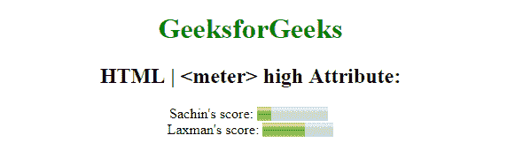
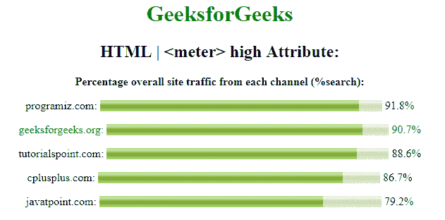

# HTML | <meter>高属性</meter>

> 原文:[https://www.geeksforgeeks.org/html-meter-high-attribute/](https://www.geeksforgeeks.org/html-meter-high-attribute/)

**HTML 高属性**用于指定仪表值被认为是高值的范围。
高属性值将小于最大属性值，但大于最小和低属性值。可与<仪表>元件配合使用。
**语法:**

```
<meter high="number">
```

**属性值:**

*   **数:**包含被认为是高值的浮点数。

**例 1:** 本例说明了高属性在米元素中的使用。

## 超文本标记语言

```
<!DOCTYPE html>
<html>

<head>
    <title>
        HTML | meter high attribute
    </title>
</head>

<body style="text-align:center;">
    <h1 style="color:green;">GeeksforGeeks</h1>
    <h2>HTML | <meter> high Attribute:</h2>
    Sachin's score:
    <meter value="2" min="0" max="10" high="6">
        2 out of 10
    </meter>
    <br>
    Laxman's score:
    <meter value="0.6" max="1.0" min="0" high="0.6">
        60% from 100%
    </meter>
</body>

</html>
```

**输出:**



**例 2:**

## 超文本标记语言

```
<!DOCTYPE html>
<html>

<head>
    <title>
        HTML | meter high attribute
    </title>
    <style>
        meter {
            width: 400px;
        }
    </style>
</head>

<body style="text-align:center;">
    <h1 style="color:green;">GeeksforGeeks</h1>
    <h2>HTML | <meter> high Attribute:</h2>
    <strong>
    Percentage overall site traffic from each channel (%search):
    </strong>

<p>programiz.com:
        <meter min="0" low="40" high="99" max="100" value="91.8">
        </meter> 91.8%
    </p>

    <p style="color:green;">geeksforgeeks.org:
        <meter min="0" low="40" high="99" max="100" value="90.7">
        </meter> 90.7%
    </p>

<p>tutorialspoint.com:
        <meter min="0" low="40" high="99" max="100" value="88.6">
        </meter> 88.6%
    </p>

<p>cplusplus.com:
        <meter min="0" low="40" high="99" max="100" value="86.7">
        </meter> 86.7%
    </p>

<p>javatpoint.com:
        <meter min="0" low="40" high="99" max="100" value="79.2">
        </meter> 79.2%
    </p>

</body>

</html>
```

**输出:**



*   谷歌 Chrome 8.0 或更高版本
*   Firefox 16.0 或更高版本
*   Opera 11.5 或以上
*   Safari 6.0 或更高版本
*   Internet Explorer 13.0