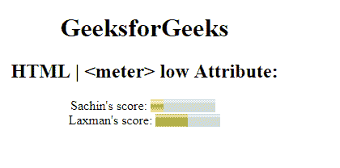

# HTML | meter 低属性

> 原文:[https://www.geeksforgeeks.org/html-meter-low-attribute/](https://www.geeksforgeeks.org/html-meter-low-attribute/)

**HTML 仪表低属性**用于指定仪表值属性被认为低的范围。低属性的值大于最小属性的值，小于最大和高属性的值。
**语法:**

```html
<meter low="number">
```

**属性值:**

*   **数字:**包含单属性数字，该数字包含一个浮点值，用于指定仪表的低值。

下面的例子说明了低属性在<meter>元素中的使用。
**例:**</meter> 

## 超文本标记语言

```html
<!DOCTYPE html>
<html>

<head>
    <title>
        HTML | meter low attribute
    </title>
</head>

<body style="text-align:center;">

    <h1>GeeksforGeeks</h1>

    <h2>HTML | <meter> low Attribute:</h2>

    Sachin's score:
    <meter value="2" low="3" min="0"
                max="10" high="6">
        5 out of 10
    </meter>
    <br>

    Laxman's score:
    <meter value="0.5" low="0.3" max="1.0"
            low=" " min="0" high="0.6">
        50% from 100%
    </meter>
</body>

</html>   
```

**输出:**



**支持的浏览器:**HTML<米>低属性支持的浏览器如下:

*   谷歌 Chrome 8.0
*   Firefox 16.0
*   Internet Explorer 13.0
*   Safari 6.0
*   歌剧 11.5
*   Internet Explorer 13.0