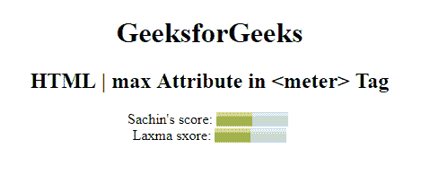

# HTML | meter 最大属性

> 原文:[https://www.geeksforgeeks.org/html-meter-max-attribute/](https://www.geeksforgeeks.org/html-meter-max-attribute/)

<仪表>元素中的**最大属性用于*指定仪表*的上限。max 属性的值必须大于 min 属性。它的默认值是 1。**

**语法:**

```html
<meter max="number">
```

**属性值:**包含数值，即**号**，指定仪表的最大值。

**示例:**本示例说明了在仪表元素中使用 max 属性。

```html
<!DOCTYPE html>
<html>
<head>
    <title>
        HTML | max attribute
    </title>
</head>

<body style="text-align:center;">
    <h1> 
      GeeksforGeeks 
  </h1>

    <h2> 
      HTML | max Attribute in  
      <meter> Tag 

  </h2> Sachin's score:

    <meter value="5" 
           min="0"
           max="10" 
           high="6">
        5 out of 10
    </meter>

    <br>Laxma sxore:
    <meter value="0.5"
           max="1.0" 
           min="0"
           high="0.6">
        50% from 100%
    </meter>

</body>

</html>
```

**输出:**


**支持的浏览器:**以下是 **HTML | <米>最大属性**支持的浏览器:

*   谷歌 Chrome
*   微软公司出品的 web 浏览器
*   火狐浏览器
*   歌剧
*   旅行队