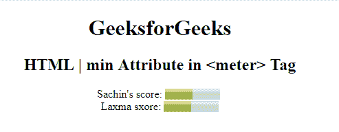

# HTML meter 最小属性

> 原文:[https://www.geeksforgeeks.org/html-meter-min-attribute/](https://www.geeksforgeeks.org/html-meter-min-attribute/)

**HTML <量表>最小属性**用于指定*量表*的下限。最小值属性的值总是小于最大值属性。它的默认值为 0。

**语法:**

```html
<meter min="number">
```

**属性值:**

*   **数字:**它包含一个指定仪表最小值的数值。

**示例:**本示例说明了米元素中最小属性的使用。

```html
<!DOCTYPE html>
<html>

<head>
    <title>
      HTML | min attribute
  </title>
</head>

<body style="text-align:center;">
    <h1>
      GeeksforGeeks
  </h1>
    <h2>
      HTML | min Attribute in 
      <meter> Tag
  </h2> Sachin's score:
    <meter value="5"
           min="0"
           max="10" 
           high="6">
      5 out of 10
  </meter>
    <br>Laxma sxore:
    <meter value="0.5" 
           max="1.0" 
           min="0"
           high="0.6">
      50% from 100% 
  </meter>
</body>

</html>
```

**输出:**


**支持的浏览器:**以下是 *HTML <仪表>最小属性*支持的浏览器:

*   谷歌 Chrome
*   微软公司出品的 web 浏览器
*   火狐浏览器
*   歌剧
*   旅行队