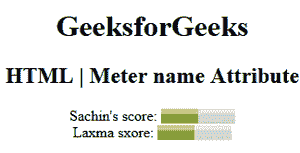

# HTML | meter 名称属性

> 原文:[https://www.geeksforgeeks.org/html-meter-name-attribute/](https://www.geeksforgeeks.org/html-meter-name-attribute/)

**HTML <仪表>名称属性**用于指定仪表元素的名称属性。它用于在提交表单后引用表单数据，或者引用 JavaScript 中的元素。
**语法:**

```html
<meter name="name">
```

**属性值:**它包含一个描述**仪表**元素名称的单一值名称。

**示例:**

```html
<!DOCTYPE html> 
<html> 

<head> 
    <title> 
        HTML | meter name attribute 
    </title> 
</head> 

<body style="text-align:center;"> 
    <h1> 
        GeeksforGeeks 
    </h1> 

    <h2> 
        HTML | Meter name Attribute
    </h2>

    Sachin's score: 
    <meter value="5" min="0" name="geeks2"
                max="10" high="6"> 
        5 out of 10 
    </meter> 

    <br>Laxma sxore: 
    <meter value="0.5" max="1.0" name="geeks3"
            min="0" high="0.6"> 
        50% from 100% 
    </meter> 
</body> 

</html>
```

**输出:**



**支持的浏览器:**以下是 **HTML <米>名称属性**支持的浏览器:

*   谷歌 Chrome
*   微软公司出品的 web 浏览器
*   火狐浏览器
*   旅行队
*   歌剧