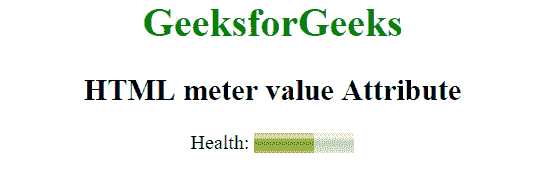
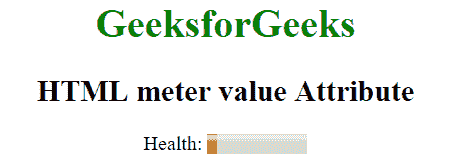

# HTML | meter 值属性

> 原文:[https://www.geeksforgeeks.org/html-meter-value-attribute/](https://www.geeksforgeeks.org/html-meter-value-attribute/)

HTML 中的 **<仪表>值属性**用于指定仪表的当前值。指定的值必须介于最小值和最大值属性之间。
**语法:**

```html
<meter value="number">
```

**属性值:**该属性包含单值**号**，为必填项。它用于指定浮点数，即仪表的当前值。
**例 1:** 本例显示健康仪表。

## 超文本标记语言

```html
<!DOCTYPE html>
<html>
    <head>
        <title>
            HTML meter value Attribute
        </title>
    </head>

    <body style = "text-align:center">

        <h1 style = "color:green;">
            GeeksforGeeks
        </h1>

        <h2>
            HTML meter value Attribute
        </h2>

        Health: <meter min="0" low="40" high="90"
                        max="100" value="60"></meter>
    </body>
</html>                   
```

**输出:**



**例 2:** 本例显示的血糖仪非常非常低。

## 超文本标记语言

```html
<!DOCTYPE html>
<html>
    <head>
        <title>
            HTML meter value Attribute
        </title>
    </head>

    <body style = "text-align:center">

        <h1 style = "color:green;">
            GeeksforGeeks
        </h1>

        <h2>
            HTML meter value Attribute
        </h2>

        Health: <meter min="0" low="33" high="66"
            max="100" optimum="80" value="10"></meter>
    </body>
</html>                   
```

**输出:**



**支持的浏览器:**米>值属性支持的浏览器如下:

*   苹果 Safari 6.0
*   谷歌 Chrome 8.0
*   Firefox 6.0
*   Opera 11.0
*   Internet Explorer 13.0