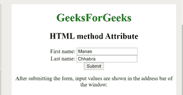

# HTML |方法属性

> 原文:[https://www.geeksforgeeks.org/html-method-attribute/](https://www.geeksforgeeks.org/html-method-attribute/)

**HTML |方法属性**用于*指定提交表单*时发送数据的 HTTP 方法。HTTP 方式有两种，分别是**获取**和**发布**。方法属性可以与 **<一起使用，形成>** 元素。
**属性值:**

*   **GET:** 在 GET 方法中，表单提交后，表单值会在新浏览器选项卡的地址栏中可见。它的大小限制在 3000 个字符左右。它仅适用于非安全数据，不适用于敏感信息。
*   **POST:** 在 POST 方法中，表单提交后，表单值在新浏览器选项卡的地址栏中将不会像在 GET 方法中一样可见。它将表单数据追加到 HTTP 请求的正文中。它没有大小限制。此方法不支持对结果添加书签。

**语法:**

```html
<form method="get|post">
```

**示例:**本示例说明了方法属性的使用。

## 超文本标记语言

```html
<!DOCTYPE html>
<html>

<body style="text-align:center;">
    <h1 style="color:green;">
    GeeksForGeeks
</h1>

    <h2>HTML  method Attribute</h2>
    <form id="users"
          action="#"
          method="GET"
          target="_blank">
        First name:

        <input type="text"
               name="fname"
               value="Manas">

        <br> Last name:
        <input type="text"
               name="lname"
               value="Chhabra">

        <br>
        <input type="submit"
               value="Submit">
    </form>

<p>
      After submitting the form,
      input values are shown in the address
      bar of the window.
  </p>

</body>

</html>
```

**输出:**



**支持的浏览器:***HTML 方法属性*支持的浏览器如下:

*   谷歌 Chrome
*   微软公司出品的 web 浏览器
*   火狐浏览器
*   歌剧
*   旅行队