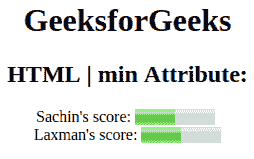

# HTML |最小属性

> 原文:[https://www.geeksforgeeks.org/html-min-attribute/](https://www.geeksforgeeks.org/html-min-attribute/)

**HTML | min 属性**用于*指定量表的下限。*最小属性值必须小于最大属性值。它的默认值为 0。既可以在 [**<上输入>**](https://www.geeksforgeeks.org/html-input-min-attribute/?ref=rp) 又可以在 [**<上输入>**](https://www.geeksforgeeks.org/html-meter-min-attribute/?ref=rp) 元素。

*   [**<输入>**](https://www.geeksforgeeks.org/html-input-min-attribute/?ref=rp) 当最小属性出现在输入元素中时，它指定一个<输入>元素的最小值。
    **语法:**

```html
<input min="number|date">
```

*   **示例-1:** 该示例说明了输入元素中 min 属性的使用。

## 超文本标记语言

```html
<!DOCTYPE html>
<html>

<body style="text-align:center;">

    <h1 style="color:green;">
            GeeksForGeeks
        </h1>

    <h2>
      HTML | min Attribute in Input Field
  </h2>
    <form id="myGeeks">
        <input type="number"
               id="myNumber"
               step="5"
               name="geeks"
               placeholder="multiples of 5"
               min="10">
    </form>
    <br>
    <br>
    <p style="font-size:20px;">
      The minimum value for an
      input field is 10.
  </p>

</body>

</html>
```

*   **输出:**


*   [**<仪表>**](https://www.geeksforgeeks.org/html-meter-min-attribute/?ref=rp) **:当仪表元件中存在**时，它指定一个仪表的最小值。
    **语法:**

```html
<meter min="number">
```

*   **示例-2:** 本示例说明了米元素中 min 属性的使用。

## 超文本标记语言

```html
<!DOCTYPE html>
<html>

<head>
    <title>
        HTML | min attribute
    </title>
</head>

<body style="text-align:center;">
    <h1>GeeksforGeeks</h1>
    <h2>
      HTML | min Attribute:
    </h2>
    Sachin's score:
    <meter value="5" min="0" max="10" high="6">
        5 out of 10
    </meter>
    <br>
    Laxman's score:
    <meter value="0.5" max="1.0" min="0" high="0.6">
        50% from 100%
    </meter>
</body>

</html>
```

*   **输出:**



**支持的浏览器:**最小属性支持的浏览器如下:

*   谷歌 Chrome 5.0
*   Internet Explorer 10.0
*   Firefox 16.0
*   歌剧 10.6
*   Safari 5.1