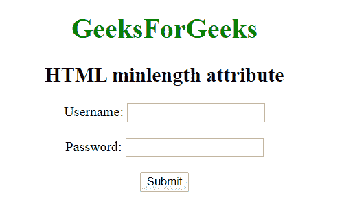

# HTML |最小长度属性

> 原文:[https://www.geeksforgeeks.org/html-minlength-attribute/](https://www.geeksforgeeks.org/html-minlength-attribute/)

**HTML 最小长度属性**用于指定用户输入到输入字段或文本区域的最小字符数(如 UTF-16 代码)。整数值必须以 0 或更高的值开始。

**语法:**

```html
<Element minlength="numeric">
```

**适用:**

*   **<输入>**
*   **< textarea >**

**属性值:**

*   **数字:包含数值，即 0 或更高。**

**示例:**

## 超文本标记语言

```html
<!DOCTYPE html>
<html>

<head>
    <title>
        HTML | minlength Attribute
    </title>
</head>

<body style="text-align: center;">

    <h1 style="color:green;">
        GeeksForGeeks
    </h1>

    <h2>minlength attribute</h2>

    <form action="">
        Username:
        <input type="text"
                name="usrname"
                minlength="10">
        <br><br>

        Password:
        <input type="text"
                name="password"
                maxlength="10">
        <br><br>

        <input type="submit"
                value="Submit">
    </form>
</body>

</html>
```

**输出:**



**支持的浏览器:HTML 最小长度属性支持的浏览器如下:**

*   **苹果 Safari**
*   **谷歌铬**
*   **Firefox**
*   **歌剧**
*   **互联网浏览器**