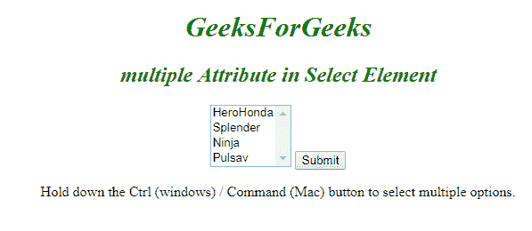

# HTML |多属性

> 原文:[https://www.geeksforgeeks.org/html-multiple-attribute/](https://www.geeksforgeeks.org/html-multiple-attribute/)

该属性是布尔属性。它指定允许用户选择一个元素中出现的多个值。
**语法:**

```html
<input/select multiple>
```

**元素:**这个方法可以有以下属性:

*   [<输入>](https://www.geeksforgeeks.org/html-input-multiple-attribute/?ref=rp)
*   [<选择>](https://www.geeksforgeeks.org/html-select-multiple-attribute/?ref=rp)

**属性:**以上元素的属性均为*倍数*。
**例:**用 [<输入>](https://www.geeksforgeeks.org/html-input-multiple-attribute/?ref=rp) 元素

## 超文本标记语言

```html
<!DOCTYPE html>
<html>

<body>
    <center>
        <h1 style="color:green;font-style:italic;">
        GeeksForGeeks
        </h1>
        <h2 style="color:green;font-style:italic;">
        multiple Attribute in Input Element
        </h2>
        <form action=" ">
            Select images:
            <input type="file" name="img" multiple>
            <input type="submit">
        </form>
</center>
</body>

</html>
```

**输出:**


**示例:**用[T5】选择>T3】元素](https://www.geeksforgeeks.org/html-select-multiple-attribute/?ref=rp) 

## 超文本标记语言

```html
<html>

<body>
    <center>
        <h1 style="color:green;font-style:italic;">
        Geeksforgeeks
        </h1>
        <h2 style="font-style:italic;color:green;">
        multiple Attribute in Select Element
        </h2>
        <form action=" ">
            <select name="Bikes" multiple>
                <option value="HeroHonda">HeroHonda</option>
                <option value="Splender">Splender</option>
                <option value="Ninja">Ninja</option>
                <option value="Pulsav">Pulsav</option>
            </select>
            <input type="submit">
        </form>

<p>
        Hold down the Ctrl (windows) / Command (Mac)
        button to select multiple options.
        </p>

</center>

</body>

</html>
```

**输出:**



**支持的浏览器:**多个属性支持的浏览器如下:

*   谷歌 Chrome 6.0
*   Internet Explorer 10.0
*   Firefox 3.6
*   Opera 11.0
*   Safari 5.0