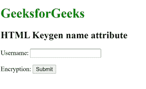

# HTML 键名属性

> 原文:[https://www.geeksforgeeks.org/html-name-attribute-2/](https://www.geeksforgeeks.org/html-name-attribute-2/)

**HTML < keygen >名称属性**用于指定 [*< keygen >元素*](https://www.geeksforgeeks.org/html-keygen-tag/) *的名称。*

**语法:**

```html
<keygen name="name">
```

**属性值**:包含描述 **<键根>元素名称的单个值名。**

**示例:**

## 超文本标记语言

```html
<!DOCTYPE html>
<html>
    <head>
        <title>
            HTML keygen name Attribute
        </title>
    </head>

    <body>
        <h1 style = "color:green;">
            GeeksforGeeks
        </h1>

        <h2>HTML Keygen name attribute</h2>

        <form>
            Username: <input type="text" name="uname">
            <br><br>
            Encryption: <keygen name="secure">
            <input type="submit">
        </form>
    </body>
</html>
```

**输出:**



**支持的浏览器:**

*   谷歌 Chrome
*   火狐浏览器
*   旅行队
*   歌剧