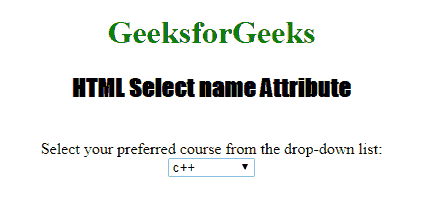

# HTML |名称属性

> 原文:[https://www.geeksforgeeks.org/html-name-attribute/](https://www.geeksforgeeks.org/html-name-attribute/)

**HTML 名称属性**用于指定元素的名称。借助这个属性，我们可以在 JavaScript 中引用这个元素。

**支持的标签:**

*   [按钮](https://www.geeksforgeeks.org/html-button-name-attribute/)
*   [字段集](https://www.geeksforgeeks.org/html-fieldset-name-attribute/)
*   [表格](https://www.geeksforgeeks.org/html-form-name-attribute/)
*   [iframe](https://www.geeksforgeeks.org/html-iframe-name-attribute/)
*   [输入](https://www.geeksforgeeks.org/html-input-name-attribute/)
*   [地图](https://www.geeksforgeeks.org/html-map-name-attribute/)
*   [当](https://www.geeksforgeeks.org/html-meta-name-attribute/)
*   [对象](https://www.geeksforgeeks.org/html-object-name-attribute/)
*   [输出](https://www.geeksforgeeks.org/html-output-name-attribute/)
*   [我的钱](https://www.geeksforgeeks.org/html-param-name-attribute/)
*   [选择](https://www.geeksforgeeks.org/html-select-name-attribute/)
*   textarea
*   键

**示例:** HTML 按钮名称属性

## 超文本标记语言

```html
<!DOCTYPE html>
<html>
    <head>
        <title>
            HTML button name Attribute
        </title>
    </head>

    <body>
        <h1>GeeksforGeeks</h1>

        <h3>HTML button name Attribute</h3>

        <form action="#" method="get">
            Username: <input type="text" name="uname">

            <br><br>

            Password: <input type="password" name="pwd">

            <br><br>

            <button type="submit" value="submit">
                Submit
            </button>
        </form>
    </body>
</html>                    
```

**输出:**


**示例:** HTML 选择名称属性

## 超文本标记语言

```html
<!DOCTYPE html>
<html>

<head>
    <title>
        HTML Select name Attribute
    </title>
</head>

<body style="text-align:center;">

    <h1 style="color:green;">
        GeeksforGeeks
    </h1>

    <h2 style="font-family: Impact;">
    HTML Select name Attribute
    </h2>
    <br> Select your preferred
course from the drop-down list:
    <br>

    <select name="Courses Titles" id="myCourses">
        <option value="C++">c++</option>
        <option value="Placement">Placement</option>
        <option value="Java">Java</option>
        <option value="Python">Python</option>
    </select>

</body>

</html>
```

**输出:**



**支持的浏览器:****HTML |名称属性**支持的浏览器如下:

*   谷歌 Chrome
*   微软公司出品的 web 浏览器
*   火狐浏览器
*   苹果 Safari
*   歌剧