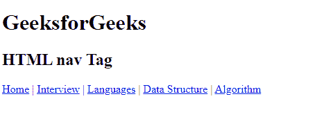
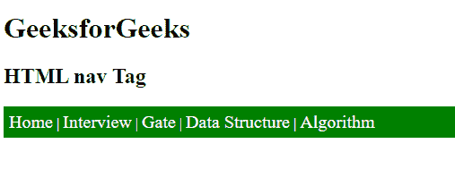

# HTML nav 标签

> 原文:[https://www.geeksforgeeks.org/html-nav-tag/](https://www.geeksforgeeks.org/html-nav-tag/)

<nav>标签用于在 HTML 文档中声明导航部分。网站通常有专门用于导航链接的部分，这使用户能够导航网站。这些链接可以放在导航标签里面。换句话说，nav 元素表示页面的一部分，其目的是提供导航链接，无论是在当前文档中还是到另一个文档。导航元素中的链接可能指向其他网页或同一网页的不同部分。它是一个语义元素。导航元素的常见例子有菜单、表格、目录和索引。</nav>

导航标签是为主要导航区域保留的，就像页面或部分顶部的主菜单一样。一个文档可能有几个导航元素，例如，站点导航和一个页面内导航。导航标签中的链接可以是 ul 列表中的代码，也可以简单地编码为独立的链接，没有 ul 元素。这个元素使创建导航菜单变得更加容易，创建一个整洁的文本链接水平菜单，并帮助屏幕阅读软件正确识别文档中的主要导航区域。

**语法:**

```html
<nav> Links... </nav>
```

**示例:**

## 超文本标记语言

```html
<!DOCTYPE html>
<html>

<body>
    <h1>GeeksforGeeks</h1>
    <h2> HTML nav Tag</h2>
    <!-- nav tag starts -->
    <nav>
        <a href="#">Home</a> |
        <a href="#">Interview</a> |
        <a href="#">Languages</a> |
        <a href="#">Data Structure</a> |
        <a href="#">Algorithm</a>
    </nav>
    <!-- nav tag ends -->
</body>

</html>
```

**输出:**



**示例:**使用 CSS 样式化导航。

## 超文本标记语言

```html
<!DOCTYPE html>
<html>

<head>
    <style>
        nav {
            border: 1px;
            background-color: green;
            color: white;
            padding: 6px;
        }

        a {
            text-decoration: none;
            color: white;
            font-size: 20px;
        }
    </style>
</head>

<body>
    <h1>GeeksforGeeks</h1>
    <h2>HTML nav Tag</h2>
    <!-- nav tag starts -->
    <nav>
        <a href=
"https://www.geeksforgeeks.org/">
                Home</a> |
        <a href=
"https://www.geeksforgeeks.org/company-interview-corner/">
                Interview</a> |
        <a href=
"https://www.geeksforgeeks.org/gate-cs-notes-gq/">
                Gate</a> |
        <a href=
"https://www.geeksforgeeks.org/data-structures/">
                Data Structure</a> |
        <a href=
"https://www.geeksforgeeks.org/fundamentals-of-algorithms/">
                Algorithm</a>
    </nav>
    <!-- nav tag ends -->
</body>

</html>
```

**输出:**



**支持的浏览器:**

*   谷歌 Chrome 6.0 及以上版本
*   Internet Explorer 9.0 及以上版本
*   Mozilla 4.0 及以上版本
*   Safari 5.0 及以上版本
*   Opera 11.1 及以上