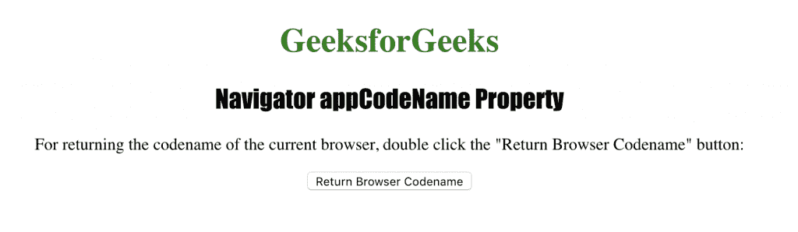
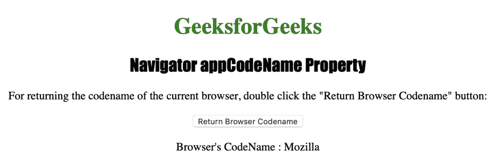

# HTML |导航器 appCodeName 属性

> 原文:[https://www . geesforgeks . org/html-navigator-appcodename-property/](https://www.geeksforgeeks.org/html-navigator-appcodename-property/)

**Navigator appCodeName** 属性用于返回浏览器的代码名称。它是只读属性，一般来说，所有现代浏览器都返回“Mozilla”。

**语法:**

```html
navigator.appCodeName
```

**返回值:**返回一个代表浏览器代码名的字符串。

下面的程序说明了导航器 appCodeName 属性:
**1。获取浏览器的代码名。**

```html
<!DOCTYPE html>
<html>

<head>
    <title>
      Navigator appCodeName Property in HTML
    </title>
    <style>
        h1 {
            color: green;
        }

        h2 {
            font-family: Impact;
        }

        body {
            text-align: center;
        }
    </style>
</head>

<body>

    <h1>GeeksforGeeks</h1>
    <h2>Navigator appCodeName Property</h2>

    <p>
      For returning the codename of the current browser,
      double click the "Return Browser Codename" button:
    </p>

    <button ondblclick="codename()">
      Return Browser Codename
    </button>

    <p id="BrowserName"></p>

    <script>
        function codename() {
            var b = 
                "Browser's CodeName : " + navigator.appCodeName;
            document.getElementById("BrowserName").innerHTML = b;
        }
    </script>

</body>

</html>             
```

**输出:**


**点击**
按钮后

**支持的浏览器:**下面列出的*导航器 appCodeName 属性*支持的浏览器:

*   谷歌 Chrome
*   微软公司出品的 web 浏览器
*   火狐浏览器
*   歌剧
*   旅行队