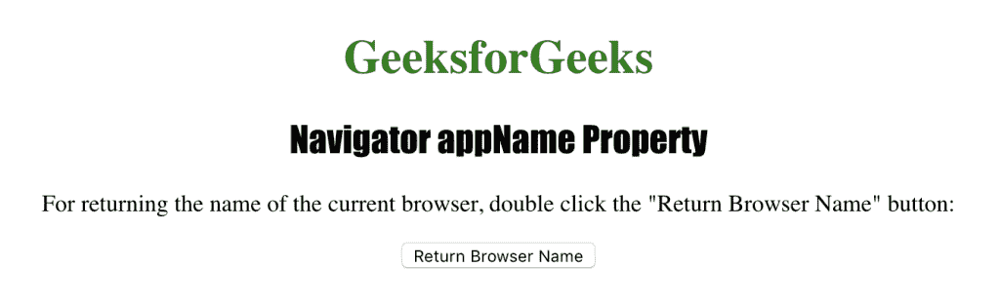
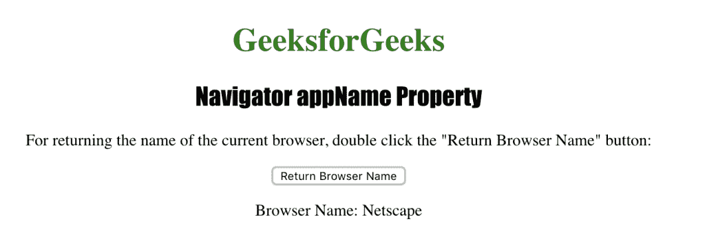

# HTML |导航器 appName 属性

> 原文:[https://www . geesforgeks . org/html-navigator-app name-property/](https://www.geeksforgeeks.org/html-navigator-appname-property/)

**导航器 appName 属性:**

*   它用于返回浏览器的名称。
*   它是一个只读属性，它返回的值因浏览器而异。
*   它返回一个代表浏览器名称的字符串。
*   对于 IE11、火狐、Chrome 和 Safari，它返回“网景”，而对于 IE 10 和更早的版本，它返回“微软互联网浏览器”。
    对于 Opera，导航器 appName 属性返回“Opera”。

**语法:**

```html
navigator.appName
```

下面的程序说明了导航器 appName 属性:
**获取浏览器的代码名。**

```html
<!DOCTYPE html>
<html>

<head>
    <title>
      Navigator appName Property in HTML
    </title>
    <style>
        h1 {
            color: green;
        }

        h2 {
            font-family: Impact;
        }

        body {
            text-align: center;
        }
    </style>
</head>

<body>

    <h1>GeeksforGeeks</h1>
    <h2>Navigator appName Property</h2>

    <p>
      For returning the name of the current browser, 
      double click the "Return Browser Name" button: 
    </p>

    <button ondblclick="browsername()">
      Return Browser Name
    </button>

    <p id="browser"></p>

    <script>
        function browsername() {
            var b = "Browser Name: " + navigator.appName;
            document.getElementById("browser").innerHTML = b;
        }
    </script>

</body>

</html>
```

**输出:**


**点击**
按钮后

**支持的浏览器:***导航器 appName 属性*支持的浏览器如下:

*   微软公司出品的 web 浏览器
*   谷歌 Chrome
*   火狐浏览器
*   歌剧
*   旅行队