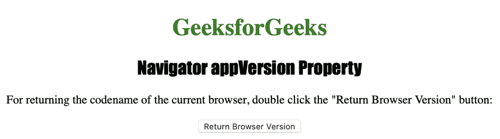
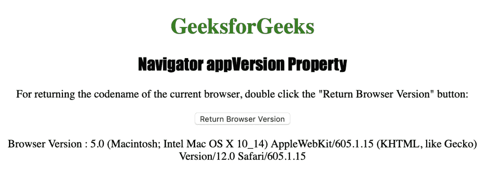

# HTML |导航器 appVersion 属性

> 原文:[https://www . geesforgeks . org/html-navigator-app version-property/](https://www.geeksforgeeks.org/html-navigator-appversion-property/)

**导航器应用版本**属性是一个只读属性，它返回一个代表浏览器版本信息的字符串。它用于返回与浏览器版本相关的信息。

**语法:**

```html
navigator.appVersion
```

下面的程序说明了导航器 appVersion 属性:
**获取浏览器的版本信息。**

```html
<!DOCTYPE html>
<html>

<head>
    <title>
      Navigator appVersion Property in HTML
    </title>
    <style>
        h1 {
            color: green;
        }

        h2 {
            font-family: Impact;
        }

        body {
            text-align: center;
        }
    </style>
</head>

<body>

    <h1>GeeksforGeeks</h1>
    <h2>Navigator appVersion Property </h2>

    <p>
      For returning the codename of the current browser,
      double click the "Return Browser Version" button: 
    </p>

    <button ondblclick="version()">
      Return Browser Version
    </button>

    <p id="BrowserVersion"></p>

    <script>
        function version() {
            var v = 
                "Browser Version : " + navigator.appVersion;
            document.getElementById("BrowserVersion").innerHTML = v;
        }
    </script>

</body>

</html>
```

**输出:**


**点击**
按钮后

**支持的浏览器:***导航器 appVersion* 支持的浏览器如下:

*   谷歌 Chrome
*   微软公司出品的 web 浏览器
*   火狐浏览器
*   歌剧
*   旅行队