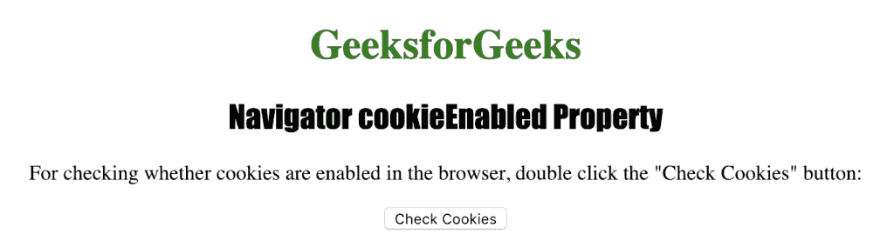
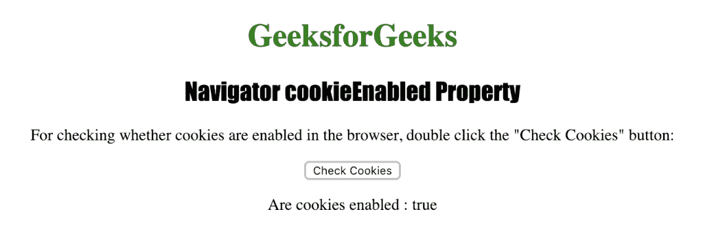

# HTML |导航器菜单启用属性

> 原文:[https://www . geeksforgeeks . org/html-navigator-cookieenabled-property/](https://www.geeksforgeeks.org/html-navigator-cookieenabled-property/)

**cookiesEnabled 属性**用于返回一个布尔值，该值指定浏览器是否启用了 cookie。如果启用了 cookies，则返回 true，否则返回 false。

**语法:**

```html
navigator.cookieEnabled
```

下面的程序说明了导航器 cookieEnabled 属性:
**检查浏览器是否启用了 cookies。**

```html
<!DOCTYPE html>
<html>

<head>
    <title>
      Navigator cookieEnabled Property in HTML
    </title>
    <style>
        h1 {
            color: green;
        }

        h2 {
            font-family: Impact;
        }

        body {
            text-align: center;
        }
    </style>
</head>

<body>

    <h1>GeeksforGeeks</h1>
    <h2>Navigator cookieEnabled Property</h2>

    <p>
      For checking whether cookies are enabled in the browser,
      double click the "Check Cookies" button:
    </p>

    <button ondblclick="checkcookies()">Check Cookies</button>

    <p id="check"></p>

    <script>
        function checkcookies() {
            var c = 
                "Are cookies enabled : " + navigator.cookieEnabled;
            document.getElementById("check").innerHTML = c;
        }
    </script>

</body>

</html>

```

**输出:**


**点击按钮后:**


**支持的网络浏览器**

*   谷歌 Chrome
*   微软公司出品的 web 浏览器
*   火狐浏览器
*   歌剧
*   旅行队