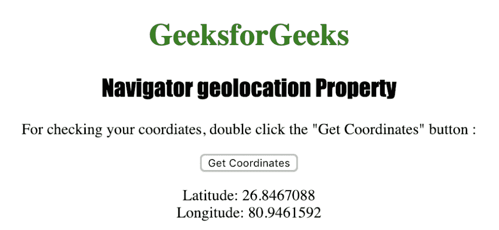

# HTML |导航器地理定位属性

> 原文:[https://www . geesforgeks . org/html-navigator-geolocation-property/](https://www.geeksforgeeks.org/html-navigator-geolocation-property/)

**导航器地理定位**属性用于通过浏览器返回地理定位对象，该对象可用于定位用户的位置。
这是一个只读属性，只有在用户同意的情况下才可用，因为它会损害用户的隐私。
**语法:**

```html
navigator.geolocation
```

下面的程序说明了导航器地理位置属性:
**检查用户的地理位置。**T3】

## 超文本标记语言

```html
<!DOCTYPE html>
<html>

<head>
    <title>Navigator geolocation Property in HTML</title>
    <style>
        h1 {
            color: green;
        }

        h2 {
            font-family: Impact;
        }

        body {
            text-align: center;
        }
    </style>
</head>

<body>

    <h1>GeeksforGeeks</h1>
    <h2>Navigator geolocation Property</h2>

<p>For checking your coordinates,
      double click the "Get Coordinates" button : </p>

    <button ondblclick="getCoordinates()">Get Coordinates</button>

    <p id="loc"></p>

    <script>
        var x = document.getElementById("loc");

        function getCoordinates() {
            if (navigator.geolocation) {
                navigator.geolocation.getCurrentPosition(showcoordinates);
            } else {
                x.innerHTML = "The browser doesn't support Geolocation.";
            }
        }

        function showcoordinates(myposition) {
            x.innerHTML = "Your Latitude is: " + myposition.coords.latitude +
                "<br>Your Longitude is: " + myposition.coords.longitude;
        }
    </script>

</body>

</html>
```

**输出:**


**点击**按钮后



**支持的浏览器:***导航仪地理位置*支持的浏览器如下:

*   谷歌 Chrome
*   微软公司出品的 web 浏览器
*   火狐浏览器
*   歌剧
*   旅行队