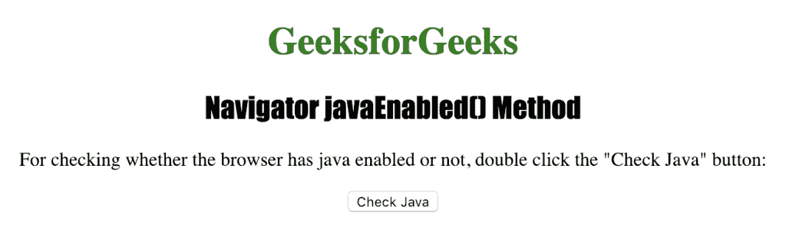
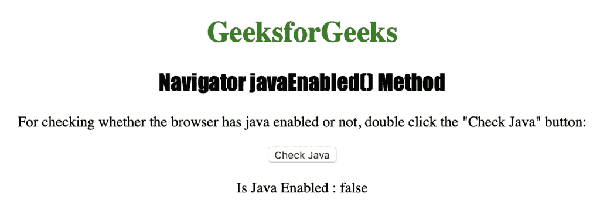

# HTML |导航器 javaEnabled()方法

> 原文:[https://www . geesforgeks . org/html-navigator-javaenabled-method/](https://www.geeksforgeeks.org/html-navigator-javaenabled-method/)

**navigator javaEnabled()** 方法用于返回一个布尔值，该值指定是否在浏览器中启用 Java。如果在浏览器中启用了 Java，则返回 true，否则返回 false。
**语法:**

```html
navigator.javaEnabled()
```

**返回值:**布尔值，表示浏览器是否启用了 Java。如果启用，则返回 true，否则返回 false。

下面的程序说明了 Navigator javaEnabled()方法:
**检查浏览器是否启用了 Java。**T3】

## 超文本标记语言

```html
<!DOCTYPE html>
<html>

<head>
    <title>
      Navigator javaEnabled() Method in HTML
    </title>
    <style>
        h1 {
            color: green;
        }

        h2 {
            font-family: Impact;
        }

        body {
            text-align: center;
        }
    </style>
</head>

<body>

    <h1>GeeksforGeeks</h1>
    <h2>Navigator javaEnabled() Method</h2>

<p>
      For checking whether the browser has Java
      enabled or not, double-click the "Check Java"
      button:
    </p>

    <button ondblclick="check_java()">
      Check Java
    </button>

    <p id="jav"></p>

    <script>
        function check_java() {
            var j =
                "Is Java Enabled : " + navigator.javaEnabled();
            document.getElementById("jav").innerHTML = j;
        }
    </script>

</body>

</html>
```

**输出:**



**点击**按钮后



**支持的浏览器:**T2 航海家 javaEnabled() 支持的浏览器如下:

*   谷歌 Chrome
*   微软公司出品的 web 浏览器
*   火狐浏览器
*   歌剧
*   旅行队