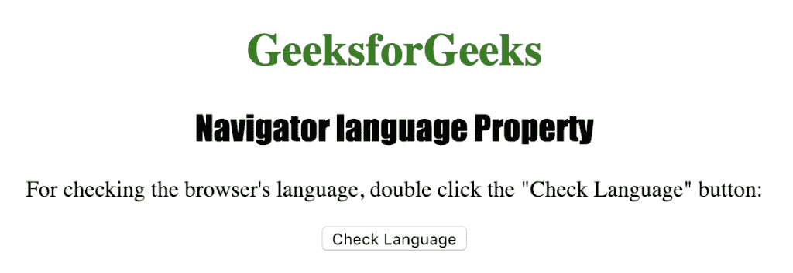
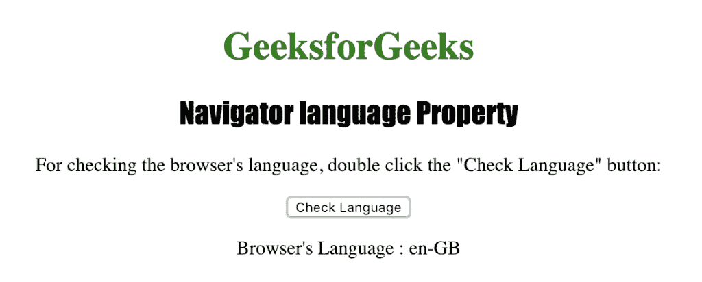

# HTML |导航器语言属性

> 原文:[https://www . geesforgeks . org/html-navigator-language-property/](https://www.geeksforgeeks.org/html-navigator-language-property/)

**Navigator 语言**属性用于返回浏览器的语言版本。它是一个只读属性，并返回一个表示浏览器语言版本的字符串。

一些可能的语言代码是:

*   在美国
*   fr
*   在中
*   (加在动词之前）表示“否定”，“相反”；(加在名词之前构成动词)表示“除去”，“除掉”

**语法:**

```html
navigator.language

```

下面的程序说明了导航语言属性:

**检查浏览器的语言版本。**

## 超文本标记语言

```html
<!DOCTYPE html>
<html>

<head>
    <title>
      Navigator language Property in HTML
    </title>
    <style>
        h1 {
            color: green;
        }

        h2 {
            font-family: Impact;
        }

        body {
            text-align: center;
        }
    </style>
</head>

<body>

    <h1>GeeksforGeeks</h1>
    <h2>Navigator language Property</h2>

<p>For checking the browser's language,
       double click the "Check Language" button:
    </p>

    <button ondblclick="checklang()">
      Check Language
    </button>

    <p id="lang"></p>

    <script>
        function checklang() {
            var l =
                "Browser's Language : " + navigator.language;
            document.getElementById("lang").innerHTML = l;
        }
    </script>

</body>

</html>
```

**输出:**



**点击**按钮后



**支持的浏览器:**HTML |*导航器语言属性*支持的浏览器如下:

*   谷歌 Chrome
*   微软公司出品的 web 浏览器
*   火狐浏览器
*   歌剧
*   旅行队