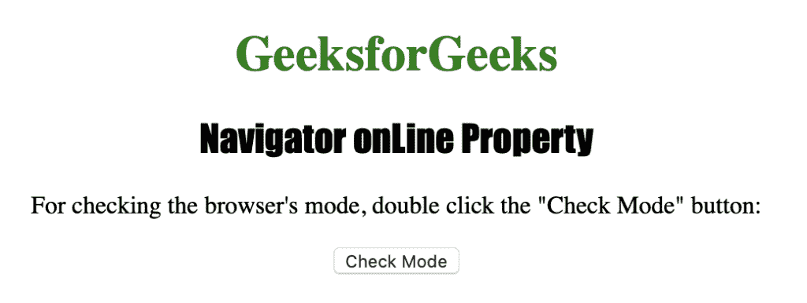
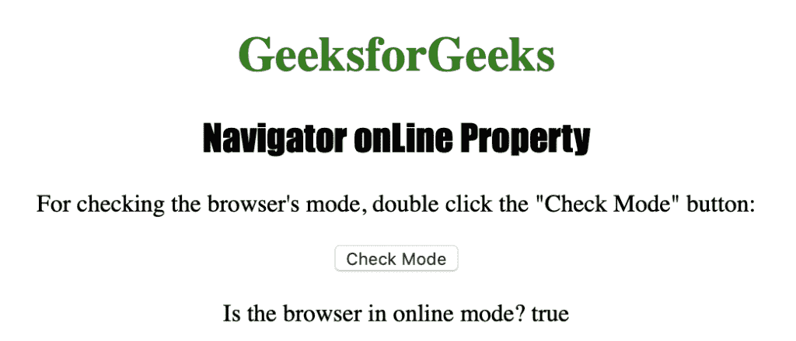

# HTML |导航器在线属性

> 原文:[https://www . geesforgeks . org/html-navigator-online-property/](https://www.geeksforgeeks.org/html-navigator-online-property/)

**导航器在线**属性用于返回一个布尔值，该值指定浏览器是处于在线模式还是离线模式。
这是一个只读属性，如果浏览器处于联机模式，则返回 true 如果处于脱机模式，则返回 false。
**语法:**

```html
navigator.onLine
```

**返回值:**布尔值，表示浏览器是在线模式还是离线模式。如果浏览器在线，则返回 true，否则返回 false

下面的程序说明了导航器在线属性:
**检查浏览器是在线还是离线模式。**T3】

## 超文本标记语言

```html
<!DOCTYPE html>
<html>

<head>
    <title>
      Navigator onLine Property in HTML
    </title>
    <style>
        h1 {
            color: green;
        }

        h2 {
            font-family: Impact;
        }

        body {
            text-align: center;
        }
    </style>
</head>

<body>

    <h1>GeeksforGeeks</h1>
    <h2>Navigator onLine Property</h2>

<p>
      For checking the browser's mode,
      double click the "Check Mode" button:
    </p>

    <button ondblclick="checkmode()">
      Check Mode
    </button>

    <p id="mode"></p>

    <script>
        function checkmode() {

            // We use navigator.onLine to check if browser is online
            var o =
                "Is the browser in online mode? " + navigator.onLine;
            document.getElementById("mode").innerHTML = o;
        }
    </script>

</body>

</html>

```

**输出:**



**点击**按钮后



**支持的浏览器:***航海家在线*支持的浏览器如下:

*   谷歌 Chrome
*   微软公司出品的 web 浏览器
*   火狐浏览器
*   歌剧
*   苹果 Safari