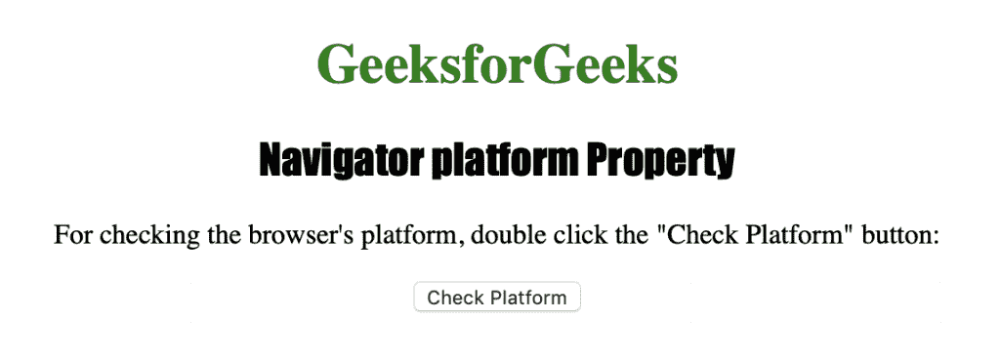
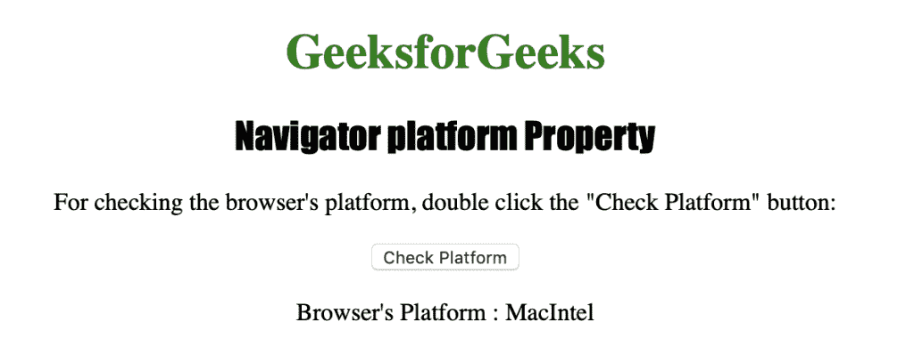

# HTML |导航器平台属性

> 原文:[https://www . geesforgeks . org/html-navigator-platform-property/](https://www.geeksforgeeks.org/html-navigator-platform-property/)

**Navigator 平台**属性用于返回编译浏览器的平台。它返回一个表示浏览器平台的字符串。
可能的值是:

*   MacIntel
*   麦克普 c
*   麦克 68K
*   Win32
*   Win16
*   SunOS(太阳)
*   惠普-UX
*   Linux i686
*   等等

**语法**

```html
navigator.platform
```

下面的程序说明了导航器平台属性:
**检查浏览器的平台。**T3】

## 超文本标记语言

```html
<!DOCTYPE html>
<html>

<head>
    <title>
      Navigator platform Property in HTML
    </title>
    <style>
        h1 {
            color: green;
        }

        h2 {
            font-family: Impact;
        }

        body {
            text-align: center;
        }
    </style>
</head>

<body>

    <h1>GeeksforGeeks</h1>
    <h2>Navigator platform Property</h2>

<p>
      For checking the browser's platform,
      double click the "Check Platform" button:
    </p>

    <button ondblclick="checkplatform()">
      Check Platform
    </button>

    <p id="plat"></p>

    <script>
        function checkplatform() {
            var p =
                "Browser's Platform : " + navigator.platform;
            document.getElementById("plat").innerHTML = p;
        }
    </script>

</body>

</html>
```

**输出:**



**点击**按钮后



**支持的浏览器:***航海家平台*支持的浏览器如下:

*   谷歌 Chrome
*   微软公司出品的 web 浏览器
*   火狐浏览器
*   歌剧
*   旅行队