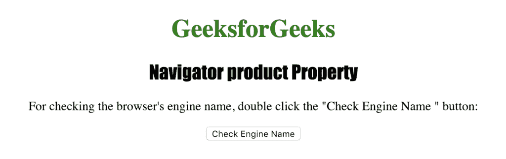
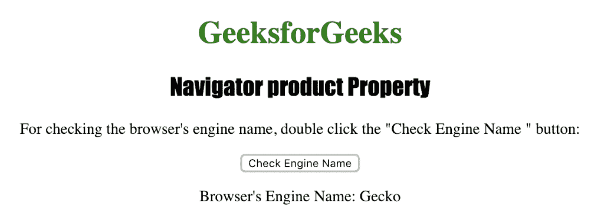

# HTML |导航器产品属性

> 原文:[https://www . geesforgeks . org/html-navigator-product-property/](https://www.geeksforgeeks.org/html-navigator-product-property/)

**Navigator 产品**属性用于返回浏览器的引擎(产品)名称。它是一个只读属性，对于大多数浏览器通常返回“gecko”。它返回一个表示浏览器引擎名称的字符串。

**语法:**

```html
navigator.product
```

**返回值:**一个字符串，代表浏览器的引擎名

以下程序说明了导航器产品属性:

**检查浏览器的引擎名称是否。**

## 超文本标记语言

```html
<!DOCTYPE html>
<html>

<head>
    <title>
      Navigator product Property in HTML
    </title>
    <style>
        h1 {
            color: green;
        }

        h2 {
            font-family: Impact;
        }

        body {
            text-align: center;
        }
    </style>
</head>

<body>

    <h1>GeeksforGeeks</h1>
    <h2>Navigator product Property</h2>

<p>
      For checking the browser's engine name,
      double click the "Check Engine Name " button: </p>

    <button ondblclick="checkengine()">
      Check Engine Name
    </button>

    <p id="name"></p>

    <script>
        function checkengine() {
            var e =
                "Browser's Engine Name: " + navigator.product;
            document.getElementById("name").innerHTML = e;
        }
    </script>

</body>

</html>
```

**输出:**



**点击按钮**后



**支持的浏览器:***航海家产品属性*支持的浏览器如下:

*   谷歌 Chrome
*   微软公司出品的 web 浏览器
*   火狐浏览器
*   歌剧
*   旅行队