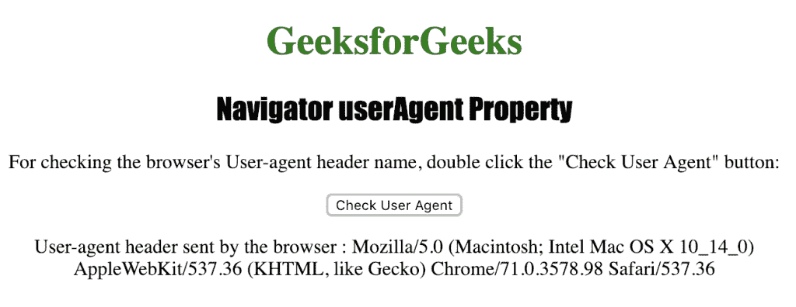

# HTML |导航器用户代理属性

> 原文:[https://www . geesforgeks . org/html-navigator-user agent-property/](https://www.geeksforgeeks.org/html-navigator-useragent-property/)

**Navigator userAgent** 属性用于返回浏览器发送给服务器的用户代理头的值。它返回一个字符串，表示浏览器的名称、版本和平台等值。
**语法:**

```html
navigator.userAgent
```

**返回值:**一个字符串，代表当前浏览器的用户代理字符串

下面的程序说明了导航用户代理属性:

## 超文本标记语言

```html
<!DOCTYPE html>
<html>

<head>
    <title>
      Navigator userAgent Property in HTML
    </title>
    <style>
        h1 {
            color: green;
        }

        h2 {
            font-family: Impact;
        }

        body {
            text-align: center;
        }
    </style>
</head>

<body>

    <h1>GeeksforGeeks</h1>
    <h2>Navigator userAgent Property</h2>

<p>
      For checking the browser's User-agent header name,
      double click the "Check User Agent" button:
    </p>

    <button ondblclick="checkua()">
      Check User Agent
    </button>

    <p id="header"></p>

    <script>
        function checkua() {
            var u =
                "User-agent header sent by the browser : "
                                     + navigator.userAgent;
            document.getElementById("header").innerHTML = u;
        }
    </script>

</body>

</html>  
```

**输出:**


**点击**按钮后



**支持的浏览器:***航海家用户代理*支持的浏览器如下:

*   谷歌 Chrome
*   微软公司出品的 web 浏览器
*   火狐浏览器
*   歌剧
*   旅行队