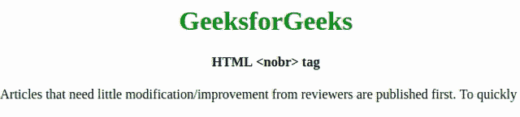

# HTML | nobr 标签

> [https://www.geeksforgeeks.org/html-nobr-tag/](https://www.geeksforgeeks.org/html-nobr-tag/)

**< nobr >** 标记用于创建单行文本，那不管语句有多长，这个标记与 [**< wbr >**](https://www.geeksforgeeks.org/html-5-wbr-tag/) 标记一起使用。创建的单行语句使水平滚动阅读整行。 **< nobr >** 标签与 [< br >](https://www.geeksforgeeks.org/html-br-tag/) 标签完全相反。您可以使用 CSS 空白属性来替换这个标记。

**语法:**

```html
<nobr> Statement </nobr>
```

**属性:**这个标签不包含任何属性。

以下示例说明了 **HTML < nobr >标签:**
**示例:**

```html
<!Doctype html>
<html>

<head>
    <title>HTML nobr Tag</title>
    <isindex prompt="Search" />
    <style>
        h1 {
            color: green;
        }
    </style>
</head>

<body>
    <center>
        <h1>GeeksforGeeks</h1>
        <h4>HTML <nobr> tag</h4>
        <nobr>
            Articles that need little modification/improvement
        from reviewers are published first. To quickly get your 
        articles reviewed, please refer existing articles, their
        formating style, coding style, and try to make your close
        to them.
        </nobr>
    </center>
</body>

</html>                   
```

**输出:**


**支持的浏览器:**以下列出了 **HTML < nobr >** 标签支持的浏览器:

*   谷歌 Chrome
*   微软公司出品的 web 浏览器
*   火狐浏览器
*   旅行队
*   歌剧