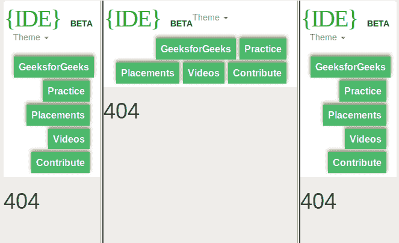
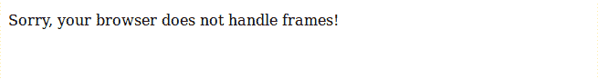

# HTML | noframes 标签

> 哎哎哎:# t0]https://www . geeksforgeeks . org/html-no frames 标签/

**< noframes >** 标签是那些不支持框架的浏览器的备份。这个标签可以包含所有可以放置在 **<身上的元素>** 标签。它用于创建与任何网站的非框架集版本的链接，您希望在其中向用户显示消息。HTML5 不支持这个 **< noframes >** 标签。

**语法:**

```html
<noframes> Statement for the user </noframes>
```

**注意:** *< noframes >* 标签放置在 *< frameset >* 标签内部。

下面的例子说明了

<noframes>标签:
T2【例子:</noframes>

```html
<html>

<head>
    <title>noframes tag</title>
    <style>
        frame {
            text-align: center;
        }
    </style>
</head>

<!-- frameset attribute starts here -->
<frameset cols="30%, 40%, 30%">
    <frame src="frame_a.htm" />
    <frame src="frame_b.htm" />
    <frame src="frame_c.htm" />
    <noframes>
        Sorry, your browser does not handle frames!
    </noframes>
</frameset>
<!-- frameset attribute ends here -->

</html>
```

**输出:**

*   如果支持浏览器:
    *   If browsers does not supported:
    

    **支持的浏览器:**以下列出了 *HTML < noframes >标签*支持的浏览器:

    *   谷歌 Chrome
    *   微软公司出品的 web 浏览器
    *   火狐浏览器
    *   旅行队
    *   歌剧