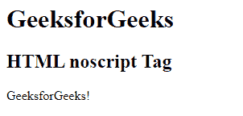

# HTML noscript 标签

> 原文:[https://www.geeksforgeeks.org/html-noscript-tag/](https://www.geeksforgeeks.org/html-noscript-tag/)

HTML 中的

<noscript>标签用于显示不支持脚本标签的浏览器或用户禁用脚本的浏览器的文本。这个标签用在<a href="https://www.geeksforgeeks.org/html-head-tag/"> &lt;头&gt; </a>和<a href="https://www.geeksforgeeks.org/html-body-tag/"> &lt;身&gt; </a>标签中。</noscript>

**注意:**这个标签只用于那些不支持脚本的浏览器。

**语法:**

```html
<noscript> Contents... </noscript>
```

下面的例子说明了 HTML 中的

<noscript>标签:</noscript>

**示例:**

## 超文本标记语言

```html
<html>

<body>
    <h1>GeeksforGeeks</h1>
    <h2>HTML noscript Tag</h2>
    <script>
        document.write("GeeksforGeeks!")
    </script>
    <!-- noscript tag starts -->
    <noscript>A computer science portal</noscript>
    <!-- noscript tag ends -->

</body>

</html>
```

**输出:**



**支持的浏览器:**

*   谷歌 Chrome
*   微软公司出品的 web 浏览器
*   火狐浏览器
*   歌剧
*   旅行队