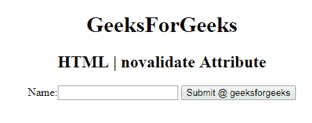

# HTML |新数据属性

> 原文:[https://www.geeksforgeeks.org/html-novalidate-attribute/](https://www.geeksforgeeks.org/html-novalidate-attribute/)

**HTML 更新属性**用于*指定提交表单*时不验证表单数据。它是一个布尔属性。它可以与 **<一起构成>** 元素。
**适用:**

*   [**<形成>**T3】](https://www.geeksforgeeks.org/html-form-novalidate-attribute/?ref=rp)

**语法:**

```html
<form novalidate>
```

**示例:**本示例说明了 **novalidate** 属性在表单元素中的使用。

## 超文本标记语言

```html
<!DOCTYPE html>
<html>

<head>
    <title>
        HTML | novalidate Attribute
    </title>
</head>

<body style="text-align:center;">
    <h1>
        GeeksForGeeks
    </h1>

    <h2>
        HTML | novalidate Attribute
    </h2>

    <form action="#"
          method="get"
          target="_self" novalidate>
        Name:
        <input type="text">
        <input type="submit"
               id="Geeks"
               name="myGeeks"
               value="Submit @ geeksforgeeks"
               formTarget="_blank">
    </form>

</body>

</html>
```

**输出:**



**支持的浏览器:**由 *novalidate* 属性支持的浏览器如下:

*   谷歌 Chrome 10.0
*   Internet Explorer 10.0
*   Firefox 4.0
*   歌剧 10.6