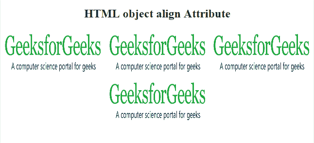

# HTML | object 对齐属性

> 原文:[https://www.geeksforgeeks.org/html-object-align-attribute/](https://www.geeksforgeeks.org/html-object-align-attribute/)

**HTML <对象>对齐属性**用于指定对象元素的对齐方式。它是一个内联元素，意味着不能在页面上插入新行。文本和另一个元素也可以环绕它。
**语法:**

```html
<object align="left | right | middle | top | bottom">
```

**属性值:**

*   **左:**它将对象设置为左对齐。
*   **右:**它将对象设置为右对齐。
*   **中间:**它将对象设置为中间。
*   **顶部:**它将对象设置为顶部对齐。
*   **底部:**它将对象设置为底部对齐。

**例:**

## 超文本标记语言

```html
<!DOCTYPE html>
<html>

<head>
    <title>
        HTML object align Attribute
    </title>
</head>

<body style="text-align:center;">

    <h2>HTML object align Attribute</h2>

    <object id="myobject"
            width="200"
            height="100"
            align="left"
            data=
"https://cdncontribute.geeksforgeeks.org/wp-content/uploads/geek-8.png">
    </object>

    <object id="myobject"
            width="200"
            height="100"
            align="right"
            data=
"https://cdncontribute.geeksforgeeks.org/wp-content/uploads/geek-8.png">
    </object>
    <object id="myobject"
            width="200"
            height="100"
            align="middle"
            data=           
"https://cdncontribute.geeksforgeeks.org/wp-content/uploads/geek-8.png">
    </object>
    <object id="myobject"
            width="200"
            height="100"
            align="top"
            data=
"https://cdncontribute.geeksforgeeks.org/wp-content/uploads/geek-8.png">
    </object>
</body>

</html>
```

**输出:**



**支持的浏览器:****HTML 对象对齐属性**支持的浏览器如下:

*   谷歌 Chrome 10.0
*   Internet Explorer 10.0
*   Firefox 4.0
*   歌剧 10.6
*   苹果 Safari