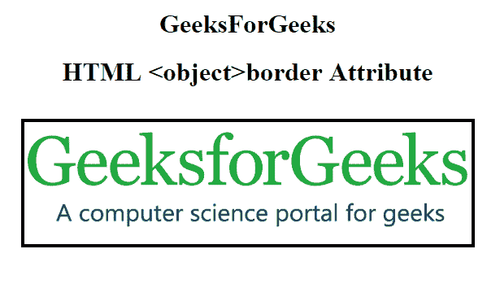

# HTML | object 边框属性

> 原文:[https://www.geeksforgeeks.org/html-object-border-attribute/](https://www.geeksforgeeks.org/html-object-border-attribute/)

**HTML <对象>边框属性**用于定义**对象**元素周围边框的宽度。

**语法:**

```html
<object border="pixels">
```

**属性值:**

*   **像素:**用于以像素为单位指定边框的宽度。

**示例:**本示例说明了<对象>边框属性在 HTML 中的使用:

```html
<!DOCTYPE html> 
<html> 

<head> 
    <title> 
        HTML object border Attribute 
    </title> 
</head> 

<body> 
    <center> 
        <h1>GeeksForGeeks</h1> 

        <h1> 
            HTML <object> border Attribute 
        </h1> 
        <br> 

        <object data= 
"https://www.geeksforgeeks.org/wp-content/uploads/Geek_logi_-low_res.png"
                width="550px" height="150px" border="4"> 
            GeeksforGeeks 
        </object> 
    </center> 
</body> 

</html>
```

**输出:**


**支持的浏览器:**HTML<对象>边框属性支持的浏览器如下:

*   谷歌 Chrome
*   微软公司出品的 web 浏览器
*   火狐浏览器
*   旅行队
*   歌剧