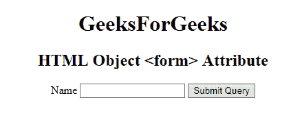

# HTML | object 表单属性

> 原文:[https://www.geeksforgeeks.org/html-object-form-attribute/](https://www.geeksforgeeks.org/html-object-form-attribute/)

**HTML <对象>表单属性**用于*指定<对象>元素所属的一个或多个表单*。

**语法:**

```html
<object form="form_id">
```

**属性值:**

*   form_id: It is used to specify the <form> elements that the <object> element belongs to . The value of this attribute should be the id attribute of the form elements.

    **示例:**

    ```html
    <!DOCTYPE html>
    <html>

    <body>
        <center>
            <object id="myobject"
                    width="400"
                    height="100"
                    name="myGeeks" 
                    form="myGeeks" 
                    data=
    "https://media.geeksforgeeks.org/wp-content/uploads/geek-8.png">
            </object>

            <h1>GeeksForGeeks</h1>
            <h2>HTML Object <form> Attribute</h2>

            <form id="myGeeks">
                <label>Name</label>
                <input type="text">
                <input type="submit">
            </form>
        </center>
    </body>

    </html>
    ```

    **输出:**
    

    **支持的浏览器:**没有浏览器支持 *HTML <对象>表单属性*。