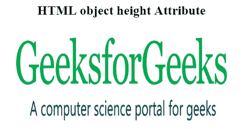

# HTML | object 身高属性

> 原文:[https://www.geeksforgeeks.org/html-object-height-attribute/](https://www.geeksforgeeks.org/html-object-height-attribute/)

**HTML <对象>高度属性**用于以像素为单位指定对象元素的高度。

**语法:**

```html
<object height="pixels">
```

**属性值:**

*   **像素:**它以像素为单位保存物体的高度。

以下示例说明了 HTML 中的<object>高度属性:</object>

**示例:**

```html
<!DOCTYPE html> 
<html> 

<head>
    <title>
        HTML object height Attribute
    </title>
</head>

<body style="text-align:center;"> 

    <h2>HTML object height Attribute</h2> 

    <object id="myobject" width="400"
                height="200" data= 
"https://media.geeksforgeeks.org/wp-content/uploads/geek-8.png"> 
    </object> 

</body> 

</html>
```

**输出:**


**支持的浏览器:**HTML 对象高度属性支持的浏览器如下:

*   谷歌 Chrome
*   微软公司出品的 web 浏览器
*   火狐浏览器
*   旅行队
*   歌剧