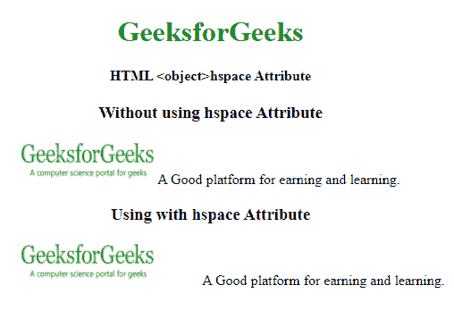
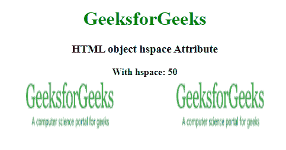

# HTML object hspace 属性

> 原文:[https://www . geesforgeks . org/html-object-hspace-attribute-2/](https://www.geeksforgeeks.org/html-object-hspace-attribute-2/)

**HTML <对象>hs space 属性**用于指定对象左右两边的空格数。

**语法:**

```html
<object hspace="pixels">  
```

**属性值:**

*   **像素:**以像素为单位指定空格数。

**注意:**HTML 5 不支持<对象>空间属性。

**示例:**下面的 HTML 代码说明了 *hspace* 属性与<对象>元素的使用。

## 超文本标记语言

```html
<!DOCTYPE html>
<html>

<head>
    <title>HTML object hspace Attribute</title>
</head>

<body>
    <center>
        <h1 style="color: green">
            GeeksforGeeks
        </h1>

        <h4>HTML <object>hspace Attribute</h4>

        <h3 style="font-weight: bold">
            Without using hspace Attribute
        </h3>

        <p>
            <object data=
"https://www.geeksforgeeks.org/wp-content/uploads/Geek_logi_-low_res.png"
                width="150px" height="50px">
                GeeksforGeeks
            </object>
            A Good platform for earning and learning.
        </p>

        <h3 style="font-weight: bold">
            Using with hspace Attribute
        </h3>

        <p>
            <object data=
"https://www.geeksforgeeks.org/wp-content/uploads/Geek_logi_-low_res.png"
                width="150px" height="50px" 
                hspace="50">
                GeeksforGeeks
            </object>
            A Good platform for earning and learning.
        </p>
    </center>
</body>

</html>
```

**输出:**



**示例 2:** 下面的代码示例说明了两个对象之间的 *hspace* 属性。

## 超文本标记语言

```html
<!DOCTYPE html>
<html>

<head>
    <title>HTML object hspace Attribute</title>
</head>

<body>
    <center>
        <h1 style="color: green">
            GeeksforGeeks
        </h1>

        <h3>HTML object hspace Attribute</h3>

        <b>With hspace: 50</b>

        <div>
            <object data=
"https://www.geeksforgeeks.org/wp-content/uploads/Geek_logi_-low_res.png"
                width="150px" height="100px" 
                hspace="50">
            </object>

            <object data=
"https://www.geeksforgeeks.org/wp-content/uploads/Geek_logi_-low_res.png"
                width="150px" height="100px" 
                hspace="50">
            </object>
        </div>
    </center>
</body>

</html>
```

**输出:**



**支持的浏览器:**

*   谷歌 Chrome
*   微软公司出品的 web 浏览器
*   微软边缘
*   火狐浏览器
*   旅行队
*   歌剧