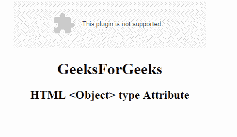

# HTML | object 类型属性

> 原文:[https://www.geeksforgeeks.org/html-object-type-attribute/](https://www.geeksforgeeks.org/html-object-type-attribute/)

**HTML <对象>类型属性**用于指定对象 MIME 类型的互联网类型。

**语法:**

```html
<object type="media_type">
```

**属性值**

*   ***media_type*** 用于指定嵌入文件的互联网媒体类型。

**示例:**

```html
<!DOCTYPE html>
<html>

<body>
    <center>
        <object id="myobject" 
                width="400" 
                height="100" 
                data=
"https://media.geeksforgeeks.org/wp-content/uploads/geek-8.png"
                type="application/vnd.adobe.flash-movie">
        </object>
        <h1>GeeksForGeeks</h1>
        <h2>HTML <Object> type Attribute</h2>
  </center>
</body>

</html>
```

**输出:**


**支持的浏览器:**HTML 对象类型属性支持的浏览器如下:

*   谷歌 Chrome
*   微软公司出品的 web 浏览器
*   火狐浏览器
*   旅行队
*   歌剧