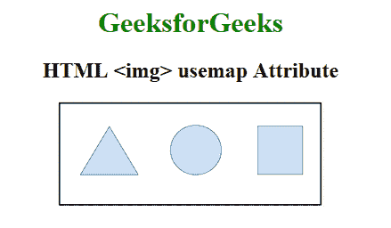

# HTML |对象使用图属性

> 原文:[https://www.geeksforgeeks.org/html-object-usemap-attribute/](https://www.geeksforgeeks.org/html-object-usemap-attribute/)

**HTML 用户地图属性**用于指定与对象一起使用的图像地图的名称。带有一些可点击区域的图像称为图像地图。
usemap 属性与关联度元素的名称属性相关，并在事物和地图之间创建关系。

**语法:**

```html
<object usemap="#mapname">
```

**属性值:**
**#地图名称:**要使用的带有地图元素名称的哈希。

**示例:**

```html
<!DOCTYPE html> 
<html> 

<head> 
    <title>HTML img usemap Attribute</title> 

    <style> 
        body { 
            text-align: center; 
        } 

        h1 { 
            color: green; 
        } 
    </style> 
</head> 

<body> 
    <h1>GeeksforGeeks</h1> 

    <h2>HTML  usemap Attribute</h2> 

    <object src= 
"https://media.geeksforgeeks.org/wp-content/uploads/20190227165729/area11.png"
        alt="" width="300" height="119" usemap="#shapemap" /> 

    <map name="shapemap"> 

        <!-- area tag contained image. -->
        <area shape="poly" coords="59, 31, 28, 83, 91, 83" href= 
"https://media.geeksforgeeks.org/wp-content/uploads/20190227165802/area2.png"
            alt="Triangle"> 

        <area shape="circle" coords="155, 56, 26" href= 
"https://media.geeksforgeeks.org/wp-content/uploads/20190227165934/area3.png"
            alt="Circle"> 

        <area shape="rect" coords="224, 30, 276, 82" href= 
"https://media.geeksforgeeks.org/wp-content/uploads/20190227170021/area4.png"
            alt="Square"> 
    </map> 
</body> 

</html>
```

**输出:**


**支持的浏览器:****HTML 对象使用地图属性**支持的浏览器如下:

*   微软公司出品的 web 浏览器
*   火狐浏览器