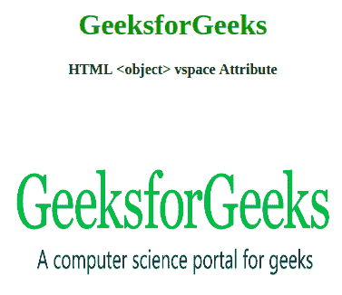
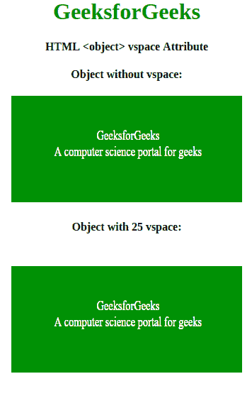

# HTML | vs space 属性

> 原文:[https://www.geeksforgeeks.org/html-object-vspace-attribute/](https://www.geeksforgeeks.org/html-object-vspace-attribute/)

**HTML <对象>vs space 属性**用于指定对象底部和顶部的空白数量。
**语法:**

```html
<object vspace="pixels"> 
```

**属性:**

*   **像素:**它以像素为单位指定对象顶部和底部的空白数量。

**注意:**HTML 5 中不支持 **<对象>**vs space 属性。使用 CSS 边距属性而不是该属性。
以下示例说明了 HTML 中的 **<对象> vspace 属性**:
**示例 1:** 在此示例中，对象的顶部和底部都有 50px 的边距。

## 超文本标记语言

```html
<!DOCTYPE html>
<html>

<head>
    <title>
        HTML object vspace Attribute
    </title>
</head>

<body>
    <center>

        <h1 style="color:green">GeeksforGeeks</h1>
        <h4>
            HTML <object> vspace Attribute
        </h4>
        <br>

        <object data=
"https://www.geeksforgeeks.org/wp-content/uploads/Geek_logi_-low_res.png"
                width="350px" height="150px" vspace=50>
            GeeksforGeeks
        </object>
    </center>
</body>

</html>
```

**输出:**



**例 2:**

## 超文本标记语言

```html
<!DOCTYPE html>
<html>

<head>
    <title>
        HTML object vspace Attribute
    </title>
</head>

<body>
    <center>

        <h1 style="color:green">GeeksforGeeks</h1>
        <h4>
            HTML <object> vspace Attribute
        </h4>
        <h4>Object without vspace:</h4>
        <object data=
"https://media.geeksforgeeks.org/wp-content/uploads/20190822082748/child.png"
                width="50%" height="150px">
            GeeksforGeeks
        </object>

        <h4>Object with 25 vspace:</h4>
        <object data=
"https://media.geeksforgeeks.org/wp-content/uploads/20190822082748/child.png"
                width="50%" height="150px" vspace="25">
            GeeksforGeeks
        </object>
    </center>

</body>

</html>
```

**输出:**



**支持的浏览器:**T2 HTML<对象> vspace 属性支持的浏览器如下:

*   谷歌 Chrome
*   微软公司出品的 web 浏览器
*   火狐浏览器
*   歌剧
*   旅行队