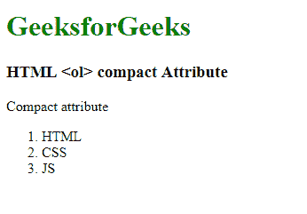

# HTML | ol 紧凑属性

> 原文:[https://www.geeksforgeeks.org/html-ol-compact-attribute/](https://www.geeksforgeeks.org/html-ol-compact-attribute/)

**HTML < ol >紧凑属性**用于通过减少列表项目之间的空间和列表的缩进来定义列表应该比正常的小。它是一个布尔属性。
**语法:**

```html
<ol compact>
```

**注意:**HTML 5 不支持 HTML < ol >紧凑属性。
**例:**

## 超文本标记语言

```html
<!DOCTYPE html>
<html>

<head>
    <title>
        HTML ol compact Attribute
    </title>
</head>

<body>
    <h1 style="color:green;">
        GeeksforGeeks
    </h1>

    <h3>HTML <ol> compact Attribute</h3>

<p>Compact attribute</p>

    <ol compact>
        <li>HTML</li>
        <li>CSS</li>
        <li>JS</li>
    </ol>
</body>

</html>                   
```

**输出:**



**支持的浏览器:**HTML<ol>紧凑属性不被任何主流浏览器支持。