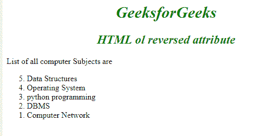

# HTML ol 反转属性

> 原文:[https://www.geeksforgeeks.org/html-ol-reversed-attribute/](https://www.geeksforgeeks.org/html-ol-reversed-attribute/)

**HTML < ol >反向属性**是一个布尔属性，用于*按降序排列列表(9，8，7，6 …..)而不是升序(1，2，3 …)*。

**语法:**

```html
<ol reversed>
    <li> Content... </li>
    <li> Content... </li>
    ...
    <li> Content... </li>
</ol>
```

**示例:**

## 超文本标记语言

```html
<!DOCTYPE html>
<html>

<head>
    <title>reversed attribute</title>
    <style>
        h1,
        h2 {
            text-align: center;
        }
    </style>
</head>

<body>
    <h1 style="color:green;font-style:italic;">
      GeeksforGeeks
  </h1>
    <h2 style="color:green;font-style:italic;">
      HTML ol reversed attribute
  </h2>

<p>List of all computer Subjects are</p>

    <ol reversed>
        <li>Data Structures</li>
        <li>Operating System</li>
        <li>python programming</li>
        <li>DBMS</li>
        <li>Computer Network</li>
    </ol>
</body>

</html>
```

**输出:**



**支持的浏览器:**

*   谷歌 Chrome
*   火狐浏览器
*   歌剧
*   旅行队