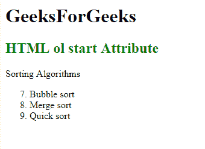

# HTML | ol 开始属性

> 原文:[https://www.geeksforgeeks.org/html-ol-start-attribute/](https://www.geeksforgeeks.org/html-ol-start-attribute/)

**HTML < ol >开始属性**用于指定对有序列表的单个列表项进行编号的开始值。

**语法:**

```html
<ol start="number"> 
```

**属性值:**包含指定有序列表第一个列表项起始值的数值。

**示例:**本示例说明了开始属性在< ol >元素中的使用。

```html
<!DOCTYPE html>
<html>

<head>
    <title>HTML ol start Attribute</title>
    <style>
        h1,
        h2 {
            text-align: center;
        }
    </style>
</head>

<body>
    <h1>GeeksForGeeks</h1>
    <h2 style="color: green;"> 
            HTML ol start Attribute 
        </h2>

    <p>Sorting Algorithms</p>

    <ol start="7">
        <li>Bubble sort</li>
        <li>Merge sort</li>
        <li>Quick sort</li>
    </ol>
</body>

</html>
```

**输出:**


**支持的浏览器:**

*   谷歌 Chrome
*   火狐浏览器
*   边缘
*   歌剧
*   苹果 Safari