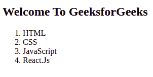
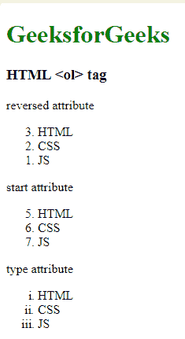

# HTML ol 标签

> 原文:[https://www.geeksforgeeks.org/html-ol-tag/](https://www.geeksforgeeks.org/html-ol-tag/)

**示例:**在本例中，我们使用< ol >标签创建了前端技术的有序列表。

## 超文本标记语言

```html
<!DOCTYPE html>
<html>

<head>
  <title>HTML Ordered Lists</title>
</head>

<body>
  <h2>Welcome To GeeksforGeeks</h2>
  <ol>
    <li>HTML</li>
    <li>CSS</li>
    <li>JavaScript</li>
    <li>React.Js</li>
  </ol>
</body>

</html>
```

**输出:**



**< ol >标签**用于有序列表，有序列表可以是数字的，也可以是字母的。在 **< ol >标签**里面，你必须列一个清单 **< li >** 的物品将按照顺序排列。
**语法:**

```html
<ol>
   <li>Item1</li>
   <li>Item2</li>
   <li>Item3</li>
</ol>
```

**属性:**

*   [**HTML < ol >紧凑属性:**](https://www.geeksforgeeks.org/html-ol-compact-attribute/) 它定义了列表应该被压缩(紧凑属性不支持 HTML5。用 CSS 代替。).
*   [**HTML < ol >反转属性:**](https://www.geeksforgeeks.org/html-ol-reversed-attribute/) 定义顺序为降序。
*   [**HTML < ol >开始属性:**](https://www.geeksforgeeks.org/html-ol-start-attribute/) 定义顺序从哪个数字或字母开始。
*   [**HTML < ol >类型属性:**](https://www.geeksforgeeks.org/html-ol-type-attribute/) 它定义了您想要在列表中的数字、字母或罗马数字的顺序类型(1、A、A、I 和 I)。

**示例:**

## 超文本标记语言

```html
<!DOCTYPE html>
<html>

<head>
  <title>HTML ol tag</title>
</head>

<body>
  <h1 style="color:green;">GeeksforGeeks</h1>
  <h3>HTML <ol> tag</h3>

  <p>reversed attribute</p>
  <ol reversed>
    <li>HTML</li>
    <li>CSS</li>
    <li>JS</li>
  </ol>

  <p>start attribute</p>
  <ol start=5>
    <li>HTML</li>
    <li>CSS</li>
    <li>JS</li>
  </ol>

  <p>type attribute</p>
  <ol type="i">
    <li>HTML</li>
    <li>CSS</li>
    <li>JS</li>
  </ol>

</body>

</html>
```

**输出:**



**支持的浏览器:**

*   谷歌 Chrome
*   微软公司出品的 web 浏览器
*   火狐浏览器
*   旅行队
*   歌剧