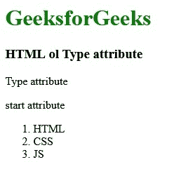

# HTML | ol 类型属性

> 原文:[https://www.geeksforgeeks.org/html-ol-type-attribute/](https://www.geeksforgeeks.org/html-ol-type-attribute/)

**HTML < ol >类型属性**定义了您想要在列表中的数字、字母或罗马数字的顺序类型(1、A、A、I 和 I)。

**语法:**

```html
<ol type="1 | a | A | i | I">
```

**属性值**

*   **1:** 这是默认值。它以十进制数定义列表项。(1, 2, 3, 4 .).
*   **a:** 用字母顺序的小写字母定义列表项。(a、b、c、d……)
*   **A:** 用字母顺序的大写字母定义列表项。(甲、乙、丙、丁..)
*   **i:** 以小写罗马数字顺序定义列表项。(一、二、三、四、五、六……)
*   **I:** 以大写罗马数字顺序定义列表项。(一、二、三、四、五、六..)

**示例:**

```html
<!DOCTYPE html> 
<html> 

<head> 
    <title>HTML ol type attribute</title> 
</head> 

<body> 
    <h1 style="color:green;">GeeksforGeeks</h1> 
    <h3>HTML ol Type attribute</h3> 

    <p>Type attribute</p> 

    <p>start attribute</p> 
    <ol type="1"> 
        <li>HTML</li> 
        <li>CSS</li> 
        <li>JS</li> 
    </ol> 

</body> 

</html>   
```

**输出:**


**支持的浏览器:**以下列出的 *ol 类型*属性支持的浏览器:

*   谷歌 Chrome
*   微软公司出品的 web 浏览器
*   火狐浏览器
*   歌剧
*   旅行队