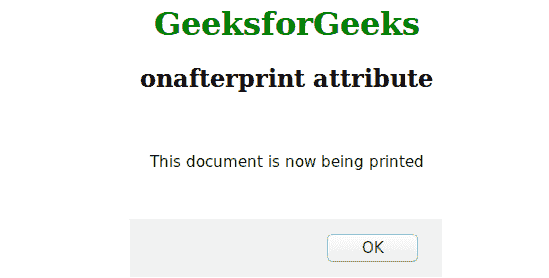

# HTML | onafterprint 事件属性

> 原文:[https://www . geesforgeks . org/html-onafter print-event-attribute/](https://www.geeksforgeeks.org/html-onafterprint-event-attribute/)

当页面已经开始打印，或者打印对话框已经关闭时，onafterprint 属性起作用。该属性与 onbeforeprint 属性一起使用。
**适用:**

*   **<体>**

**语法:**

```html
<element onafterprint = "script">
```

**属性值:**该属性包含单值脚本，在调用 onafterprint 事件属性时工作。该属性与<正文>标签相关联。
**注意:**这个属性在 HTML 5 中是新的。
**例:**

## 超文本标记语言

```html
<!DOCTYPE html>
<html>
    <head>
        <title>title attribute</title>
        <style>
            body {
                text-align:center;
            }
            h1 {
                color:green;
            }
        </style>
    </head>
    <body onafterprint="myFunction()">
        <h1>GeeksforGeeks</h1>
        <h2>onafterprint attribute</h2>
        <!-- The script run when page will print -->
        <script>
            function myFunction() {
                alert("This document is now being printed");
            }
        </script>
    </body>
</html>
```

**输出:**



**支持的浏览器:**支持 *onafterprint* 属性的浏览器如下:

*   Chrome 63.0 及以上版本
*   微软公司出品的 web 浏览器
*   火狐浏览器
*   Safari:不支持
*   歌剧:不支持