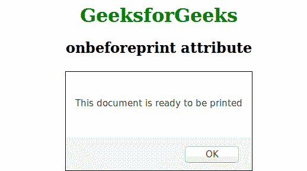

# HTML | onbeforeprint 事件属性

> 原文:[https://www . geesforgeks . org/html-onbeforeprint-event-attribute/](https://www.geeksforgeeks.org/html-onbeforeprint-event-attribute/)

onbeforeprint 属性在页面即将打印时起作用。在打印对话框出现之前会显示警告消息。onbeforeprint 属性与 onafterprint 属性一起使用。
**支持的标签**

*   **<体>**

**语法:**

```html
<element onbeforeprint = "script">
```

**属性值:**该属性包含单属性值脚本，在文档即将打印时生效。<体>标签支持该属性。
**例:**

## 超文本标记语言

```html
<!DOCTYPE html>
<html>
    <head>
        <title>onbeforeprint attribute</title>
        <style>
            body {
                text-align:center;
            }
            h1 {
                color:green;
            }
        </style>
    </head>
    <body onbeforeprint="myFunction()">
        <h1>GeeksforGeeks</h1>
        <h2>onbeforeprint attribute</h2>
        <!-- The script run when page will ready to print -->
        <script>
            function myFunction() {
                alert("This document is ready to be printed");
            }
        </script>
    </body>
</html>
```

**输出:**



**支持的浏览器:**支持的浏览器 *onbeforeprint* 属性如下:

*   Chrome 63.0 及以上版本
*   微软公司出品的 web 浏览器
*   火狐浏览器
*   Safari:不支持
*   歌剧:不支持