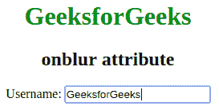
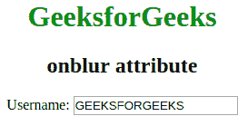

# HTML | on bulr 属性

> 原文:[https://www.geeksforgeeks.org/html-onblur-attribute/](https://www.geeksforgeeks.org/html-onblur-attribute/)

该属性在元素失去焦点的那一刻激发。该属性主要用于表单验证代码。该属性与 *onfocus* 属性相反。
**支持的标签:**它支持除之外的所有 HTML 元素，这些元素如下:

*   **T2>基地**
*   **<【bdo】>**
*   **<【br】>**
*   **<头像>**
*   **< html >**
*   **< iframe >**
*   **< 当 >**
*   **<停止>**
*   **<剧本>**
*   **<风格>**
*   **<称号>**

**语法:**

```html
<element onblur = "script">
```

**属性值:**该属性用于任何 HTML 元素。调用 on bulr 属性时脚本运行。
**例:**

## 超文本标记语言

```html
<!DOCTYPE html>
<html>
    <head>
        <title>onblur attribute</title>
        <style>
            body {
                text-align:center;
            }
            h1 {
                color:green;
            }
        </style>
    </head>
    <body>
        <h1>GeeksforGeeks</h1>
        <h2>onblur attribute</h2>

        <!-- When leave the input box then the input box
        value is converted into capital letter. -->
        Username: <input type="text" name="fname" id="GFG"
        onblur="Geeks()">
        <script>
        function Geeks() {
            var y = document.getElementById("GFG");
            y.value = y.value.toUpperCase();
        }
        </script>
    </body>
</html>                   
```

**输出:**
外点击前:



点击外部后:



**支持的浏览器:**属性*支持的浏览器如下:* 

*   谷歌 Chrome
*   微软公司出品的 web 浏览器
*   火狐浏览器
*   歌剧
*   旅行队