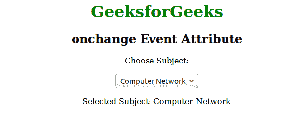

# HTML | onchange 事件属性

> 原文:[https://www . geesforgeks . org/html-onchange-event-attribute/](https://www.geeksforgeeks.org/html-onchange-event-attribute/)

当元素的值改变并从列表中选择新值时，onchange 事件属性起作用。它是事件属性的一部分。类似于 *oninput* 事件属性。但不同的是当 *oninput* 属性事件在元素值改变后立即发生，而 onchange 事件在元素失去焦点时发生。该属性与<选择>元素相关联。
**支持的标签:**

*   **<输入 type="checkbox" >**
*   **<输入 type="file" >**
*   **<输入 type="password" >**
*   **<输入 type="radio" >**
*   **<输入 type="range" >**
*   **<输入 type="search" >**
*   **<输入 type="text" >**
*   **<选择>**
*   **< textarea >**

**语法:**

```html
<element onchange = "script">
```

**属性值:**该属性包含单值*脚本*，当调用 onchange 属性时有效。
**例:**

## 超文本标记语言

```html
<!DOCTYPE html>
<html>
    <head>
        <title>onchange event attribute</title>
        <style>
            body {
                text-align:center;
            }
            h1 {
                color:green;
            }
        </style>
    </head>
    <body>
        <h1>GeeksforGeeks</h1>
        <h2>onchange Event Attribute</h2>

<p>Choose Subject:</p>

        <select id="GFG" onchange="Geeks()">
        <option value="Data Structure">Data Structure
        <option value="Algorithm">Algorithm
        <option value="Computer Network">Computer Network
        <option value="Operating System">Operating System
        <option value="HTML">HTML
        </select>
        <p id="sudo"></p>

        <script>
            function Geeks() {
                var x = document.getElementById("GFG").value;
                document.getElementById("sudo").innerHTML =
                "Selected Subject: " + x;
            }
        </script>
    </body>
</html>                   
```

**输出:**



**支持的浏览器:**T2 onchange 事件属性支持的浏览器如下:

*   苹果 Safari
*   谷歌 Chrome
*   火狐浏览器
*   歌剧
*   微软公司出品的 web 浏览器