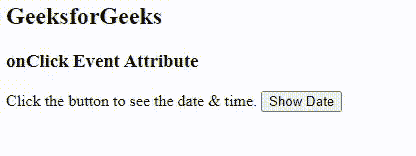
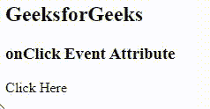
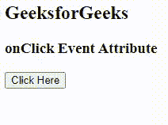

# HTML 点击事件属性

> 原文:[https://www.geeksforgeeks.org/html-onclick-event-attribute/](https://www.geeksforgeeks.org/html-onclick-event-attribute/)

**示例:**此示例显示了简单的 onClick 事件，单击按钮以 HTML 格式显示日期&时间。

## 超文本标记语言

```html
<!DOCTYPE html>
<html>
<body>
    <h2>GeeksforGeeks</h2>
    <h3>onClick Event Attribute</h3>
    <span>Click the button to see the date & time.</span>
    <button onclick="getElementById('time').innerHTML= Date()">
        Show Date
    </button>
    <p id="time"></p>

</body>
</html>
```

**输出:**



onclick 事件属性在用户单击按钮时起作用。当鼠标点击元素时，脚本运行。

**语法:**

```html
<element onlick = "script">
```

**属性值:**该属性包含一个单值脚本，当鼠标点击元素时可以工作。

**支持的标签:**除了<基础>、< bdo >、< br >、< head >、< html >、< iframe >、< meta >、< param >、<脚本>、<样式>和<标题>外，所有 HTML 标签都支持该属性

**示例 1:** 在本例中，当点击“点击此处”时，将显示文本“欢迎来到极客论坛”。

## 超文本标记语言

```html
<!DOCTYPE HTML>
<html>
<head>
    <title> onclick event attribute </title>
    <script>

    /* If onclick event call then
       this script will run */

    function onclick_event() {
        document.getElementById("geeks").innerHTML =
        "Welcome to GeeksforGeeks!";
    }
    </script>
</head>

<body>
    <h2>GeeksforGeeks</h2>
    <h3>onClick Event Attribute</h3>

    <!-- onclick event call here -->

    <p id="geeks" onclick="onclick_event()">
        Click Here
    </p>

</body>
</html>
```

**输出:**



**示例 2:** 在本例中，我们使用了按钮标签来调用事件。

## 超文本标记语言

```html
<!DOCTYPE html>
<html>
<head>
    <title> onclick event attribute </title>
    <script>
    document.getElementById("geeks").addEventListener("click", functionClick);

    function functionClick() {
        document.getElementById("geeks").innerHTML =
        "Welcome to GeeksforGeeks!";
    }
    </script>
</head>

<body>
    <h2>GeeksforGeeks</h2>
    <h3>onClick Event Attribute</h3>

    <!-- onclick event call here -->
    <button onclick="functionClick()"> Click Here </button>
    <p id="geeks"></p>

</body>
</html>
```

**输出:**



**支持的浏览器:**

*   谷歌 Chrome 93.0 及以上
*   微软边缘 93.0
*   火狐 93.0 及以上版本
*   Safari 14.1
*   Opera 79.0