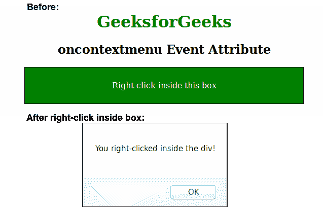

# HTML | oncontextmenu 事件属性

> 原文:[https://www . geesforgeks . org/html-oncontextmenu-event-attribute/](https://www.geeksforgeeks.org/html-oncontextmenu-event-attribute/)

当用户右键单击一个元素以打开上下文菜单时，该属性起作用。
**支持的标签:**

*   它支持所有的 HTML 元素。

**语法:**

```html
<element oncontextmenu="script">
```

**属性值:**该属性包含单值*脚本*。调用 oncontextmenu 属性时要运行的脚本。所有 HTML 元素都支持它。
**注意:**这个属性在 HTML 5 中是新的。
**例:**

## 超文本标记语言

```html
<!DOCTYPE html>
<html>
    <head>
        <title>oncontextmenu Event Attribute</title>
        <style>
            div {
                background: Green;
                border: 1px solid black;
                padding: 10px;
                width:60%;
                color:white;
            }
            h1 {
                color:green;
            }
        </style>
    </head>
    <body>
        <center>
        <h1>GeeksforGeeks</h1>
        <h2>oncontextmenu Event Attribute</h2>
        <div oncontextmenu="myFunction()" contextmenu="mymenu">

<p>Right-click inside this box</p>

        </div>
        <script>
            function myFunction() {
                alert("You right-clicked inside the div!");
            }
        </script>
        </center>
    </body>
</html>
```

**输出:**



**支持的浏览器:**oncontext menu 属性支持的浏览器如下:

*   铬
*   微软公司出品的 web 浏览器
*   火狐浏览器
*   旅行队
*   歌剧