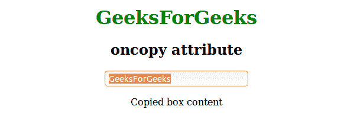
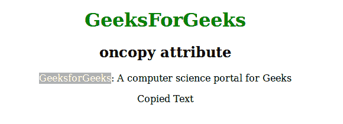

# HTML | oncopy 属性

> 原文:[https://www.geeksforgeeks.org/html-oncopy-attribute/](https://www.geeksforgeeks.org/html-oncopy-attribute/)

当用户复制了元素中存在的内容时，该属性将激发。oncopy 属性用于、<input>、

等元素。

**语法:**

```html
<element oncopy = "script">
```

**属性:**该属性接受 oncopy 调用时运行单值脚本。

**注意:**复制一个元素的内容有 3 种方式:

*   按 CTRL + C 复制一个元素。
*   从编辑菜单中选择“复制”。
*   右键单击显示上下文菜单，并选择“复制”命令

**例 1:**

```html
<!DOCTYPE html>
<html>
    <head>
        <title>oncopy attribute</title>
        <style>
            body {
                text-align:center;
            }
            h1 {
                color:green;
            }
        </style>
    </head>
    <body>
        <h1>GeeksForGeeks</h1>
        <h2>oncopy attribute</h2>
        <input type="text" oncopy="Geeks()" value="GeeksForGeeks">
        <p id="sudo"></p>
        <script>
            function Geeks() {
                document.getElementById("sudo").innerHTML = "Copied box content"
            }
        </script>
    </body>
</html>                    
```

**输出:**


**例 2:**

```html
<!DOCTYPE html>
<html>
    <head>
        <title>oncopy attribute</title>
        <style>
            body {
                text-align:center;
            }
            h1 {
                color:green;
            }
        </style>
    </head>
    <body>
        <h1>GeeksForGeeks</h1>
        <h2>oncopy attribute</h2>
        <p oncopy="Geeks()">GeeksforGeeks: A computer science portal for Geeks</p>
        <p id="sudo"></p>
        <script>
            function Geeks() {
                document.getElementById("sudo").innerHTML = "Copied Text"
            }
        </script>
    </body>
</html>                    
```

**输出:**


**支持的浏览器:**支持的浏览器 *oncopy* 事件属性如下:

*   微软公司出品的 web 浏览器
*   谷歌 Chrome
*   火狐浏览器
*   歌剧
*   旅行队