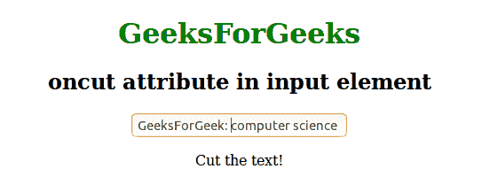
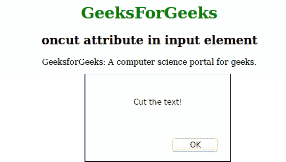

# HTML | oncut 属性

> 原文:[https://www.geeksforgeeks.org/html-oncut-attribute/](https://www.geeksforgeeks.org/html-oncut-attribute/)

当用户剪切或删除元素中已存在的内容时，此属性将激发。这是一个布尔类型属性。所有的 HTML 元素都支持这个属性，但是内容可编辑属性设置为“真”的元素是可能的。

**注意:**有 3 种方法可以剪切一个元素的内容:

*   按 CTRL + X
*   从浏览器的“编辑”菜单中选择“剪切”
*   右键单击，然后选择“剪切”命令

**语法:**

```html
<element oncut = "script">
```

**属性:**该属性是事件属性的一部分，可以用在任何 HTML 元素中。该脚本将在 oncut 属性调用时运行。

**例 1:**

```html
<!DOCTYPE html>
<html>
    <head>
        <title>oncut attribute</title>
        <style>
            body {
                text-align:center;
            }
            h1 {
                color:green;
            }
        </style>
    </head>
    <body>
        <h1>GeeksForGeeks</h1>
        <h2>oncut attribute in input element</h2>
        <input type = "text" oncut = "Geeks()"
        value = "GeeksForGeek: A computer science portal for Geeks">
        <p id = "sudo"></p>
        <script>
            function Geeks() {
                document.getElementById("sudo").innerHTML = "Cut the text!";
        }
        </script>
    </body>
</html>                    
```

**输出:**


**例 2:**

```html
<!DOCTYPE html>
<html>
    <head>
        <title>oncut attribute</title>
        <style>
            body {
                text-align:center;
            }
            h1 {
                color:green;
            }
        </style>
    </head>
    <body>
        <h1>GeeksForGeeks</h1>
        <h2>oncut attribute in input element</h2>
        <p contenteditable = "true" oncut = "Geeks()">
        GeeksforGeeks: A computer science portal for geeks.</p>
        <script>
            function Geeks() {
                alert("Cut the text!");
            }
        </script>
    </body>
</html>                    
```

**输出:**


**支持的浏览器:**由 *oncut* 属性支持的浏览器如下:

*   谷歌 Chrome
*   微软公司出品的 web 浏览器
*   火狐浏览器
*   歌剧
*   旅行队