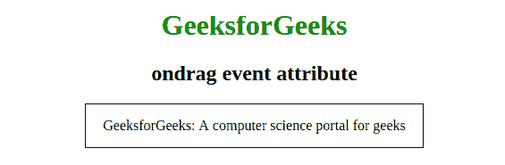

# HTML | ondrag 事件属性

> 原文:[https://www.geeksforgeeks.org/html-ondrag-event-attribute/](https://www.geeksforgeeks.org/html-ondrag-event-attribute/)

当在 HTML 中拖动元素或文本选择时，ondrag 事件属性起作用。此事件与拖放事件非常相似。这个属性在 HTML 5 中是新的。
**支持的标签:**支持所有 HTML 元素。

**语法:**

```html
<element ondrag = "script">
```

**属性值:**该属性包含一个单值脚本，在拖动元素时有效。所有 HTML 元素都支持它。
**例:**

## 超文本标记语言

```html
<!DOCTYPE html>
<html>
    <head>
        <title>ondrag event attribute</title>
        <style>
            #geeks {
                border: 1px solid black;
                padding:15px;
                width:60%;
            }
            h1 {
                color:green;
            }
        </style>
    </head>
    <body>
        <center>
        <h1>GeeksforGeeks</h1>
        <h2>ondrag event attribute</h2>
        <div id = "geeks" ondrag="Function()">
            GeeksforGeeks: A computer science portal for geeks</div>
        <script>
            function Function() {
                document.getElementById("geeks").style.fontSize = "30px";
                document.getElementById("geeks").style.color = "green";
            }
        </script>
        </center>
    </body>
</html>                   
```

**输出:**
**前拖内容:**



**拖动内容后:**


**支持的浏览器:**ondrag 事件属性支持的浏览器如下:

*   Chrome 4.0
*   Internet Explorer 9.0
*   Firefox 3.5
*   Safari: 6.0
*   Opera 12.0